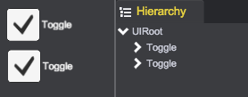

# Toggle And ToggleGroup

## Toggle
qc.Toggle component is a checkbox that allows the user to switch an option on or off.

Toggle is a composition of Background, CheckMark and Text  
  
Like the [Button](Button.html), Toggle has a state property with 3 valid states: normal, pressed and disabled.
````javascript
var node = game.add.toggle(parent);
node.background.texture = game.assets.find('__builtin_resource__');
node.background.frame = 'button.png';
node.background.imageType = qc.UIImage.IMAGE_TYPE_SLICED;
node.checkMark.texture = G.game.assets.find('__builtin_resource__');
node.checkMark.frame = 'ok.png';
node.checkMark.imageType = qc.UIImage.IMAGE_TYPE_SLICED;
node.checkMark.width = 50;
node.checkMark.height = 50;
node.text.text = 'Toggle';
node.text.color = new qc.Color(0xffffff);
node.text.fontSize = 24;
// Switch the option to on
node.on = true;
````

## ToggleGroup
Add qc.ToggleGroup component to any game object. Toggles that belong to the same ToggleGroup are constrained so that only one of them can switched on at a time - pressing one of them to switch it on automatically switches the others off.

Make a sample to bind two Toggles to a ToggleGroup:
1. Create 2 Toggles from main menu(GameObject/Toggle) or Toggle button on the toolbar  

2. Add ToggleGroup component on the UIRoot object  

3. Set the properties for ToggleGroup on Inspector panel  
  
  * Toggle - Current selected Toggle object
  * Allow Off - Is it allowed that no toggle is switched on
  * Toggles - all the Toggle objects list in this group

## API
* [Toggle API](http://docs.qiciengine.com/api/gameobject/CToggle.html)
* [ToggleGroup API](http://docs.qiciengine.com/api/components/ToggleGroup.html)

## Demo
* [Toggle Demo](http://engine.qiciengine.com/demo/Toggle/toggle_todo/index.html)
