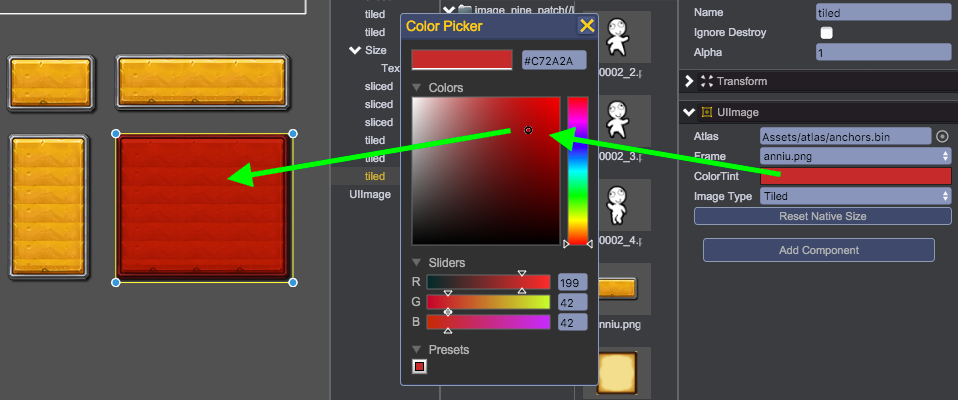

# UIImage
The qc.UIImage displays image to the user.

## Create UIImage
Create UIImage object from main menu(GameObject/Image) or toolbar's Image button.
````javascript
node = game.add.image(parent);
````
Set texture value by drag and drop from the Project panel to Inspector panel, if the texture is a atlas, you can select the specific frame name that you want it to be.
````javascript
node.texture = game.assets.find('textureKey');
node.frame = 'background.png';
````


## Image Types
UIImage supports 3 different image types: Simple, Sliced and Titled.

### Simple
The image is displayed without repeating, it will scale to fit the rectangle of the game object.
````javascript
node.imageType = qc.UIImage.IMAGE_TYPE_SIMPLE
````


### Sliced
The image is treated as a "nice-sliced" sprite with borders. The center of the image is scaled to fit the rectangle of the game object. See [Nine Patch](../NinePatch/index.html)
````javascript
node.imageType = qc.UIImage.IMAGE_TYPE_SLICED
````


### Tiled
The image is kept as its original size but is repeated as many times as necessary to fill the rectangle of the game object. If the texture is defined as [Nine Patch](../NinePatch/index.html), then it will repeat only in the center part.
````javascript
node.imageType = qc.UIImage.IMAGE_TYPE_TILED
````


## ColorTint
The colorTint applied to the node. The default value(qc.Color(0x00FFFFFF)) will remove any tint effect. See [Filter](../Filter/index.html)
````javascript
node.colorTint = new qc.Color(0x00888888);
````


<video controls="controls" src="../video/oper_uiimage.mp4"></video>  

## UIImage API
[UIImage API](http://docs.qiciengine.com/api/gameobject/CUIImage.html)

## UIImage Demo
[UIImage Demo](http://engine.qiciengine.com/demo/index.html#anchor_UIImage)
