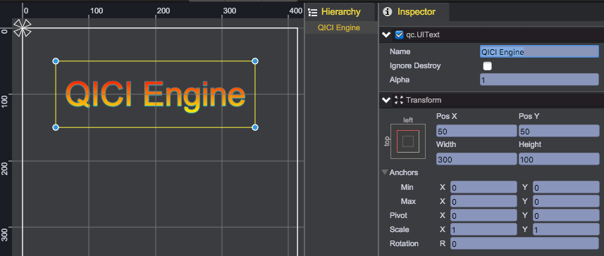
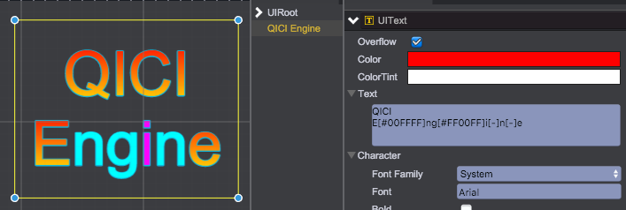
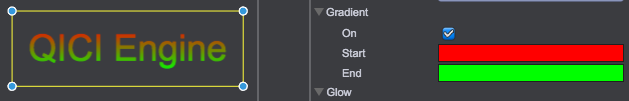

# UIText

## Font Type
Currently QICI Engine supports 3 type of fonts:
* System Font - Select "System" for "Font Family", input "Font" name like: Arial
* Web Font - Select "Web" for "Font Family", see [Web Fonts](../WebFont/README.md)
* Bitmap Font - Select "Bitmap" for "Font Family", see [Bitmap Fonts](../BitmapFont/README.md)

## Using UIText
Creates an UIText object from main menu(GameObject/Text) or toolbar, sets its bounds and text related properties:  


Text related properties values as below:  


### Overflow
Whether or not text can be displayed outside the rectangle of the node

````javascript
node.overflow = false;
````


### Color
The color of the text

````javascript
node.color = new qc.Color(0xffff0000);
````

### ColorTint
The colorTint applied to the node. The default value(qc.Color(0x00FFFFFF)) will remove any tint effect

````javascript
node.colorTint = new qc.Color(0x00888888);
````
### Text
Text context.
* Using '\n' as new line character
* By the 3 type of formats, you can set specific colors for certain characters within the Text. Support embedded colors
  * [#RRGGBB]xxx[-]
  * [rgba(255,0,0,0.3)]xxx[-]
  * [rgb(255,0,0)]xxx[-]

````javascript
node.text = 'QICI Engine';

// Using '\n' as new line character
node.text = 'QICI\nEngine';

// Set specific colors for certain characters within the Text
node.text = 'QICI\nE[#00FFFF]ng[#FF00FF]i[-]n[-]e';
````



### Font Family
Currently QICI Engine supports 3 type of fonts:
* UIText.SYSTEMFONT - System Font
* UIText.WEBFONT - Web Font
* UIText.BITMAPFONT - Bitmap Font

````javascript
node.fontFamily = qc.UIText.SYSTEMFONT;
````

### Font
Font for the text. Set the font value correspond to Font Family
````javascript
// Switch to System Font
node.fontFamily = qc.UIText.SYSTEMFONT;
// Set the font name by string
node.font = 'Tahoma'

// Switch to Web Font
node.fontFamily = qc.UIText.WEBFONT;
// Set the web font asset of qc.Font type
node.font = game.assets.find('webFontKey');

// Switch to Bitmap Font
node.fontFamily = qc.UIText.BITMAPFONT;
// Set the bitmap font asset of qc.Font type
node.font = game.assets.find('bitmapFontKey');
````

### Bold
Bold font or not
````javascript
node.bold = true;
````

### Font Size
The font size
````javascript
node.fontSize = 27;
````

### Line Spacing
The space between lines
````javascript
node.lineSpacing = 2;
````

### AlignH
Horizontal align
* UIText.LEFT - Align text to left
* UIText.RIGHT - Align text to right
* UIText.CENTER - Align text to center

````javascript
node.alignH = UIText.CENTER;
````

### AlignV
Vertical align
* UIText.TOP - Align text to top
* UIText.BOTTOM - Align text to bottom
* UIText.MIDDLE - Align text to middle

````javascript
node.alignV = UIText.MIDDLE;
````

### Wrap
Whether or not to wrap the text inside the with of the rectangle of the node
````javascript
node.wrap = true;
````

### Stroke
The stroke is the outline of the text, only valid for System Font and Web Font
Thickness - The thickness of the outline, strokeThickness
Color - The outline color, stroke

````javascript
node.strokeThickness = 2;
node.stroke = new qc.Color(0xFFFF8888);
````

### Shadow
Properties for shadow
* On - Show shadow or not, enableShadow
* Color - The shadow color, shadowColor
* Blur - The blur distance, shadowBlur
* OffsetX - The horizontal offset of the shadow, shadowOffsetX
* OffsetY - The vertial offset of the shadow, shadowOffsetY

````javascript
node.enableShadow = true;
node.shadowColor = new qc.Color(0xFFFF0000);
node.shadowBlur = 6;
node.shadowOffsetX = 2;
node.shadowOffsetY = 2;
````


### Gradient
Gradient from top to bottom, only valid for System Font and Web Font
* On - Enable gradient or not, gradient
* Start - The start color, startColor
* End - The bottom color, endColor

````javascript
node.gradient = true;
node.startColor = new qc.Color(0xFFFF0000);
node.endColor = new qc.Color(0xFF00FF00);
````


### Glow
The glow effect
* On - Show glow effect or not, enableGlow
* Color - The glow coor, glowColor
* Blur - The blur distance, glowBlur

````javascript
node.enableGlow = true;
node.glowBlur = 3;
node.glowColor = new qc.Color(0xFF0000FF);
````

## UIText Properties
[UIText](http://docs.qiciengine.com/api/gameobject/CUIText.html)

## UIText Demo
[UIText Demo](http://engine.qiciengine.com/demo/index.html#anchor_UIText)
