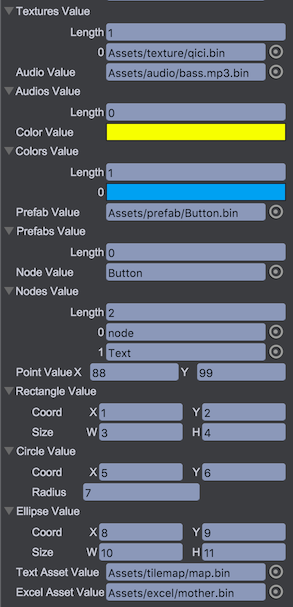

# Serialization

The serialization function of game objects is used for saving game scenes, saving prefabs, copying and pasting nodes on the hierarchy panel. Briefly, QICI Engine can serialize and deserialize any game object, including all the descendants and scripts.

## Serialization Sample
Let's create a sample to serialize and deserialize a game object for understanding the internal. Normally the users don't need to write the code below, QICI Editor will do the jobs.

### Game Object Serializing
````javascript
// Create an UIImage object
var image = game.add.image();

// Set some properties
image.x = 234;
image.y = 567;
image.rotation = 1.667788

// Serialize the image to json content
var context = {};
json = this.game.serializer.buildBundle(image, context);
json.dependences = this.game.serializer.combineDependence(context);
var content = JSON.stringify(json);
````

Through the operations above, we get the json content as below:
````
"{"class":"qc.UIImage","data":{"uuid":"6d4b3ef1-327c-40d4-b0bc-f3757257aa30","_prefab":[7,""],"name":[7,"UIImage"],"ignoreDestroy":[5,null],"alpha":[3,1],"visible":[5,true],"colorTint":[14,16777215],"static":[5,false],"scripts":[],"position":[0,0,234,567,234,567,100,100,0,0,0,0,0,0,0,0],"scaleX":[3,1],"scaleY":[3,1],"rotation":[3,1.667788],"interactive":[5,false],"isFiltersThrough":[5,null],"children":[],"texture":null,"frame":null,"imageType":[3,0]},"dependences":{}}"
````

### Game Object Deserializing
Through the code below, wen can deserialize the image object from json
````javascript
var image = game.serializer.restoreBundle(json);
image.x === 234 // true
image.y === 567 // true
image.rotation === 1.667788 // true
````

## The Serializable Value Types
Currently QICI Engine supports to value types described as below to do serialization. You need to define the value types of the fileds of script that you want to save.
* qc.Serializer.AUTO - Determine the type automatically according to the value
* qc.Serializer.INT - Integer
* qc.Serializer.INTS - Array of intergers
* qc.Serializer.NUMBER - Number
* qc.Serializer.NUMBERS - Array of numbers
* qc.Serializer.BOOLEAN - Boolean
* qc.Serializer.BOOLEANS - Array of booleans
* qc.Serializer.STRING - String
* qc.Serializer.STRINGS - Array of strings
* qc.Serializer.MAPPING - Key/value map
* qc.Serializer.TEXTURE - Texture asset
* qc.Serializer.TEXTURES - Array of texture assets
* qc.Serializer.AUDIO - Audio asset
* qc.Serializer.AUDIOS - Array of audio assets
* qc.Serializer.COLOR - qc.Color object
* qc.Serializer.COLORS - Array of qc.Color objects
* qc.Serializer.PREFAB - Prefab asset
* qc.Serializer.PREFABS - Array of prefab assets
* qc.Serializer.NODE - Game object
* qc.Serializer.NODES - Array of game objects
* qc.Serializer.POINT - qc.Point obejct
* qc.Serializer.RECTANGLE - Array of qc.Point objects
* qc.Serializer.CIRCLE - qc.Circle object
* qc.Serializer.ELLIPSE - qc.Ellipse object
* qc.Serializer.TEXTASSET - Text asset
* qc.Serializer.EXCELASSET - Excel asset

## Script Sample
1. Create a script in Assets/Scripts folder: SerializerTest.js
2. Write the code below:
````javascript
var SerializerTest = qc.defineBehaviour('qc.demo.SerializerTest', qc.Behaviour, function() {
	// Initilize the fields's value
	this.intValue = 679;
	this.intsValue = [77, 88, 99];
	this.numberValue = 123.456;
	this.numbersValue = [1.1, 2.2, 3.3];
	this.booleanValue = true,
	this.booleansValue = [false, true, false];
	this.stringValue = 'QICI Engine';
	this.stringsValue = ['A', 'BB', 'CCC'];
	this.mappingValue = { firstName: 'eric', lastName: 'lin' };
	this.textureValue = null;
	this.texturesValue = [];
	this.audioValue = null;
	this.audiosValue = [];
	this.colorValue = null;
	this.colorsValue = [];
	this.prefabValue = null;
	this.prefabsValue = [];
	this.nodeValue = null;
	this.nodesValue = [];
	this.pointValue = new qc.Point(55, 66);
	this.rectangleValue = new qc.Rectangle(1, 2, 3, 4);
	this.circleValue = new qc.Circle(100, 200, 33);
	this.ellipseValue = new qc.Ellipse(11, 22, 33, 44);
	this.textAssetValue = null;
	this.excelAssetValue = null;
}, {
	// Define the value type for the fields that need to be serialized
	intValue: qc.Serializer.INT,
	intsValue: qc.Serializer.INTS,
	numberValue: qc.Serializer.NUMBER,
	numbersValue: qc.Serializer.NUMBERS,
	booleanValue: qc.Serializer.BOOLEAN,
	booleansValue: qc.Serializer.BOOLEANS,
	stringValue: qc.Serializer.STRING,
	stringsValue: qc.Serializer.STRINGS,
	mappingValue: qc.Serializer.MAPPING,
	textureValue: qc.Serializer.TEXTURE,
	texturesValue: qc.Serializer.TEXTURES,
	audioValue: qc.Serializer.AUDIO,
	audiosValue: qc.Serializer.AUDIOS,
	colorValue: qc.Serializer.COLOR,
	colorsValue: qc.Serializer.COLORS,
	prefabValue: qc.Serializer.PREFAB,
	prefabsValue: qc.Serializer.PREFABS,
	nodeValue: qc.Serializer.NODE,
	nodesValue: qc.Serializer.NODES,
	pointValue: qc.Serializer.POINT,
	rectangleValue: qc.Serializer.RECTANGLE,
	circleValue: qc.Serializer.CIRCLE,
	ellipseValue: qc.Serializer.ELLIPSE,
	textAssetValue: qc.Serializer.TEXTASSET,
	excelAssetValue: qc.Serializer.EXCELASSET
});
````
3. Create an Empty Node object, click 'Add Component' to add the 'qc.demo.SerializerTest' script:  
  
  
  

## Custom Serialization
Custom serialization is the process of controlling the serialization and deserialization of a type.
````javascript
var SerializerTest = qc.defineBehaviour('qc.demo.SerializerTest', qc.Behaviour, function() {
		// internal values
	    this.xValue = 100;
	    this.yValue = 200;
	    this.zValue = 300;
	}, {
		// Define a property name vector3d for serialization
	    vector3d: {
	    	// Define the read function
	        get: function(object) {
	            return [object.xValue, object.yValue, object.zValuke];
	        },
	        // Define the write function
	        set: function(object, value) {
	            if (value) {
	                object.xValue = value[0];
	                object.yValue = value[1];
	                object.zValue = value[2];
	            }
	        }
	    }
	});
````
When serializing, the [x, y, z] value is saved for the vector3d filed; when deserializing the vector3d value is set to xValue, yValue and zValue.

See [Inspector Extending](../ExtendEditor/Inspector.md)

## Demo
[Serializer Demo](http://engine.qiciengine.com/demo/misc/serializer/index.html)
