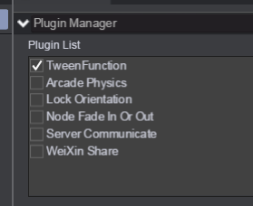
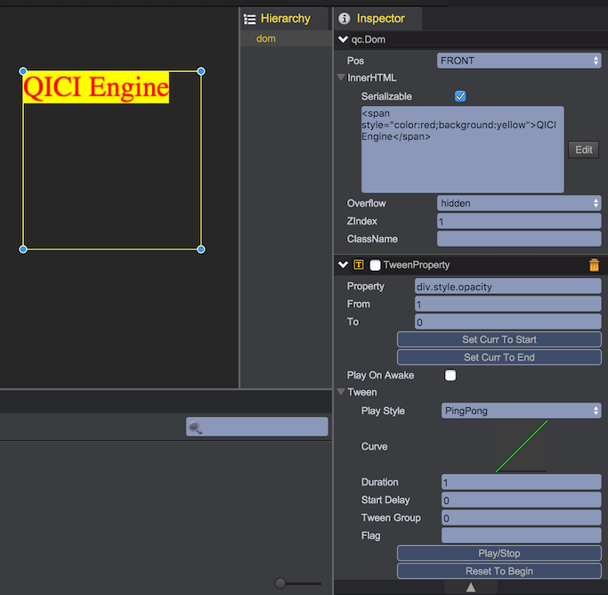
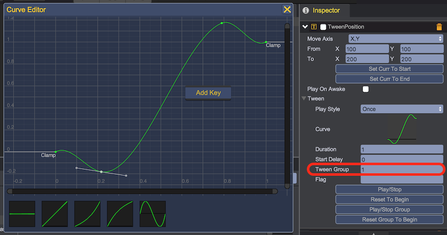

# Tween Animation
Tween component provides the function for changing property of game object over a specified time interval. Through the Curve Editor you can modify the easing function applied to the Tween, so you can get all kinds of animation effects, e.g., moving game object from A position to B position, tween can move the game object along linear path from A to B with the stable speed, or move the the game object along a nonlinear path with a slow start and end, and fast in the middle.	

## Bulit-in Tween Components
  
* __qc.TweenPosition__ - Change node's position from A to B
* __qc.TweenRotation__ - Change node's rotation from A to B
* __qc.TweenAlpha__ - Change node's alpha from A to B
* __qc.TweenColor__ - Change node's colorTint from A to B
* __qc.TweenScale__ - Change node's scaleX and scaleY from A to B
* __qc.TweenProperty__ - Change node's custom property from A to B

##  Tween Plugin
  
      
* __qc.TweenFunction__ - Invoke function every tween frame

## TweenScale Sample
Using TweenScale component to make a UIImage to zoom in and out repeatedly.

* Create an UIImage object, set pivot to (0.5, 0.5)
* Click "Add Component" button to add "Tween/TweenScale" component
* Set From as (0.5, 0.5), To as (2, 2)
* Set "Play Style" as "PingPong" 
* Set Duration as 1 second
* Click "Play/Stop" button to see the result  
  
 

Through the code below, you can get the same result:	
````javascript
// Set the original position to the center of the image
image.pivotX = 0.5;
image.pivotY = 0.5;

// Add TweenScale component
var tweenScale = image.addScript('qc.TweenScale');

// Set the start value
tweenScale.from.x = 0.5;
tweenScale.from.y = 0.5;

// Set the end value
tweenScale.to.y = 2;
tweenScale.to.x = 2;

// Set the duration to 1 second
tweenScale.duration = 1;

// Set style as pingpong mode for forward/backward loop
tweenScale.style = qc.Tween.STYLE_PINGPONG;

// Set the game obejct to the start value
tweenScale.resetToBeginning();

// play the tween in forward way
tweenScale.playForward();
````

## TweenProperty Sample
TweenProperty can be used to change the number type property of game object, Using TweenProperty we can change the opacity of the qc.Dom object's div.

* Create qc.Dom object, set its innerHTML property content
* Click "Add Component" to add "Tween/TweenProperty" component
* Set TweenProperty's property as "div.style.opacity"
* Set "From" to 1, "To" to 0, and "Play Style" as "PingPong"  
* Click "Play/Stop" to play the tween and see the result	
 	

## Tween Group Sample
If the tweens of the game object has the same tweenGroup id, they can play tween together. Here we will show you a sample to make the TweenPosition and TweenColor component to work as a tween group.

* Create an UIImage object
* Click "Add Component" button to add a "Tween/TweenColor" component
* Set "From" to yellow, "To" to red, an "Duration" to 1 second in TweenColor panel
* Click "Add Component" button to add a "Tween/TweenPosition" component
* Set "From" to (100, 100), "To" to (200, 200), and "Duration" to 1 second in TWeenPosition panel
* Click the curve in TWeenPosition panel to popup the curve editor, and add two key points
* Set the TweenColor and TweenPosition component's "Tween Group" to any nonzero number, here we pick 1
* Click the "Play/Stop Group" button on TweenColor or TweenPosition panel to see the result
	
 		
 	

Through the code below, you can get the same result:	
````javascript
// Initilize the TweenColor component
tweenColor = image.addScript('qc.TweenColor')
tweenColor.duration = 1;
tweenColor.tweenGroup = 1;
tweenColor.from = qc.Color.yellow;
tweenColor.to = qc.Color.red;

// Initilize the TweenPosition component
tweenPosition = image.addScript('qc.TweenPosition')
tweenPosition.duration = 1;
tweenPosition.tweenGroup = 1;
tweenPosition.from.set(100, 100);
tweenPosition.to.set(200, 200);

// Reset the tweens in the same group to the start value
tweenColor.resetGroupToBeginning(); // or tweenPosition.resetGroupToBeginning();

// Play the tweens in the same group
tweenColor.playGroupForward(); // or tweenPosition.playGroupForward();
````

*The tween group not only means the tweens have the same tweenGroup id in the same game object, but also includes all the tweens of the descendants of the game obejct being called.*	

## Tween Curve Editor
Last sample we custom the tween curve in the curve editor, to make the game obejct move slow at start and end, but fast in the middle, also at the start and end having the rebounce effect.		
 	

You can save the curve for reuse by click the "Save as New Curve" item of the context menu. The curve data will be save in the ProjectSetting/editor.setting file as json format.	
 	

Right click on the key point, through the popup context menu, you can delete the key point, or change the key point's edit mode to "Auto", "Free smooth", "Flat" or "Broken".	
 	

Through the code below, you can get the same result:		
````javascript
tweenPosition.curve.keys = [new qc.Keyframe(0, 0, 1, 1), 
		new qc.Keyframe(0.2, -0.18, -0.3, -0.3), 
		new qc.Keyframe(0.78, 1.2, 0.78, 0.78), 
		new qc.Keyframe(1, 1, 1, 1)];
````		
 
## Tween API

* __duration__ - The animation duration of seconds
* __delay__ - The delay seconds before playing
* __style__ - The play mode
	* qc.Tween.STYLE_ONCE - Loop once
	* qc.Tween.STYLE_LOOP - Loop infinitely
	* qc.Tween.STYLE_PINGPONG - Loop forward and backward
* __resetToBeginning(reverse)__ - Reset the property value, reverse is true as start value, or as the end value
* __resetGroupToBeginning(reverse)__ - Reset the group property value, reverse is true as start value, or as the end value
* __playForward()__ - Play the tween forward
* __playReverse()__ - Play the tween backward
* __playGroupForward()__ - Play the tween group forward
* __playGroupReverse()__ - Play the tween group backward
* __stop()__ - Stop playing
* __stopGroup()__ - Stop playing group
* __onStart__ - Start event dispatcher
* __onFinished__ - Finish event dispatcher
* __onLoopFinished__ - Loop event dispatcher

## API
[Tween API](http://docs.qiciengine.com/api/components/Tween.html)

## Demo
[Tween Demo](http://engine.qiciengine.com/demo/index.html#anchor_Tween)      