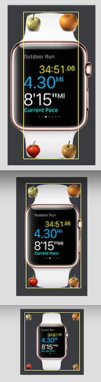
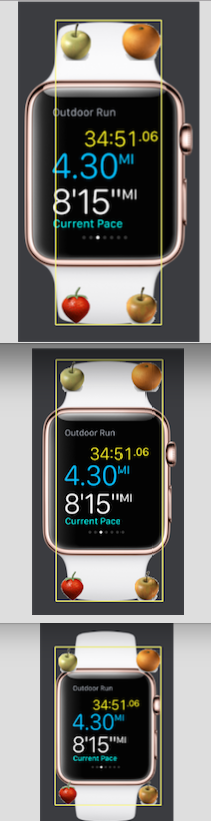

# Screen Adaptation
In this chapter you will be introduced to the UIRoot gameobject and the ScaleAdapter script. By the ScaleAdapter, the UIRoot object can adjust its size and scale to fit the game screen size automatically.
See [Demo](http://engine.qiciengine.com/demo/Layout/uiroot_adapt/index.html)

## UIRoot
Normally all the UI game objects should be put under the UIRoot object. when creating the UI objects(Image, Button, Text, .etc) from menu or toolbar, QICI Editor will try to make sure the UI objects are under an UIRoot object. If no UIRoot object in the scene, editor will create one.

## ScaleAdapter
Add a ScaleAdapter script to a node can be done by the code as below:
````javascript
scaleAdapter = node.addScript('qc.ScaleAdapter');
scaleAdapter.referenceResolution = new qc.Point(640, 960);
scaleAdapter.manualType = qc.ScaleAdapter.EXPAND;
scaleAdapter.fullTarget = true;
````

You can edit the ScaleAdapter's properties when selecting the UIRoot object in editor:  


### Reference Resolution
````javascript
scaleAdapter.referenceResolution = new qc.Point(640, 960);
````
The referenceResolution is the desired game size, or the size that is based on when the artists design the game. For example, if basing on iPhone4 or iPhone4s to prototype a game, then you can set the referenceResolution value to 640 x 960 (for Portrait) or 960 x 640 (for Landscape).

### Manual Type
A couple of types for scale adaptation are supported described as below. For explanation we create a scene for testing, in this scene we create four fruits to anchor at four corners, in the center we place a apple watch image, the referenceResolution of the UIRoot's scaleAdapter is the same with the apple watch's size.  


1. **None**
````javascript
scaleAdapter.manualType = qc.ScaleAdapter.NONE;
````
Do nothing like the script is disabled.  


2. **Height**
````javascript
scaleAdapter.manualType = qc.ScaleAdapter.MANUAL_HEIGHT;
````
Keep the height and the aspect ratio. For example the referenceResolution value is 640 x 960, and screen resolution if 400 x 480, then:
Height of UIRoot: keep 960, the same with referenceResolution.y
Scale of UIRoot: 480 / 960 = 0.5, i.e., scaleX = 0.5, scaleY = 0.5
Width of UIRoot: 400 x 960 / 480 = 800, keep aspect ratio  


3. **Width**
````javascript
scaleAdapter.manualType = qc.ScaleAdapter.MANUAL_WIDTH;
````
Keep the width and the aspect ratio. For example the referenceResolution value is 640 x 960, and screen resolution if 400 x 480, then:
Width of UIRoot: keep 640, the same with referenceResolution.x
Scale of UIRoot: 400 / 640 = 0.625, i.e., scaleX = 0.625, scaleY = 0.625
Height of UIRoot: 480 x 640 / 400 = 768, keep aspect ratio  


4. **Expand**
````javascript
scaleAdapter.manualType = qc.ScaleAdapter.EXPAND;
````
Keep the aspect ratio, make sure the whole referenceResolution size can be displayed in the screen, i.e, UIRoot's width and height are always bigger or equal than referenceResolution.x and referenceResolution.y. The ScaleAdapter will choose to base on referenceResolution.x or referenceResolution.y automatically. The ScaleAdapter.EXPAND is the mostly used type.  


5. **Shrink**
````javascript
scaleAdapter.manualType = qc.ScaleAdapter.SHRINK;
````
Keep the aspect ratio, Shrink type is different from Expand tyep, Shrink type will make the screen be filled, some content of referenceResolution size will be outside the scree bounds, i.e, UIRoot's width and height are always smaller or equal than referenceResolution.x and referenceResolution.y.  


6. **Fill**
````javascript
scaleAdapter.manualType = qc.ScaleAdapter.FILL;
````
The UIRoot's size will always be the same with the referenceResolution, the UIRoot's scale will be changed to fill the whole screen, that will not keep the aspect ratio, the UI objects will be distorted, so Fill type is seldomly used.  


