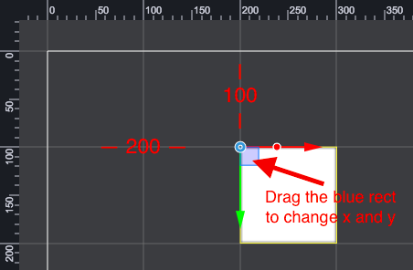
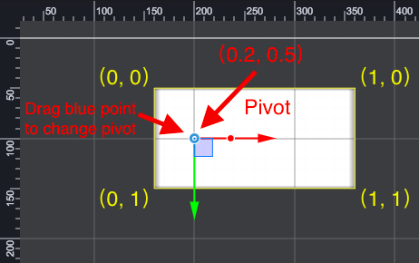
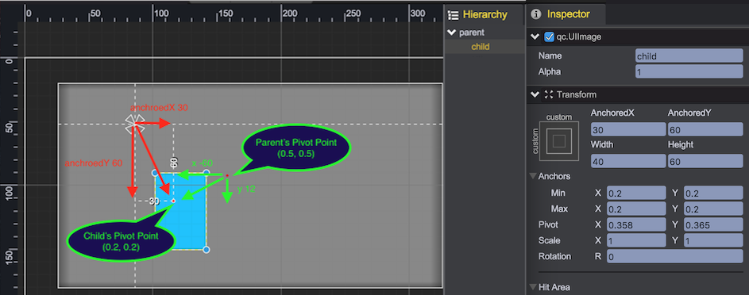
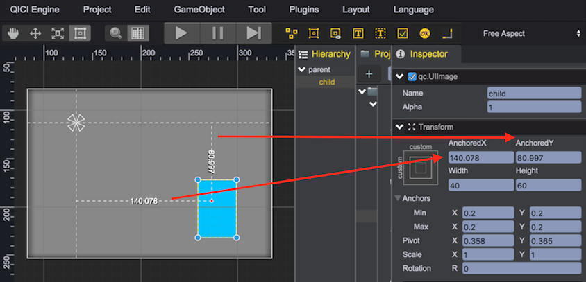
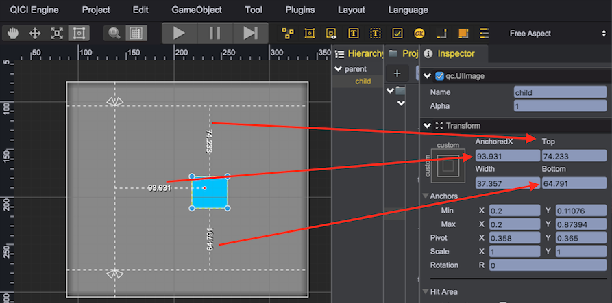
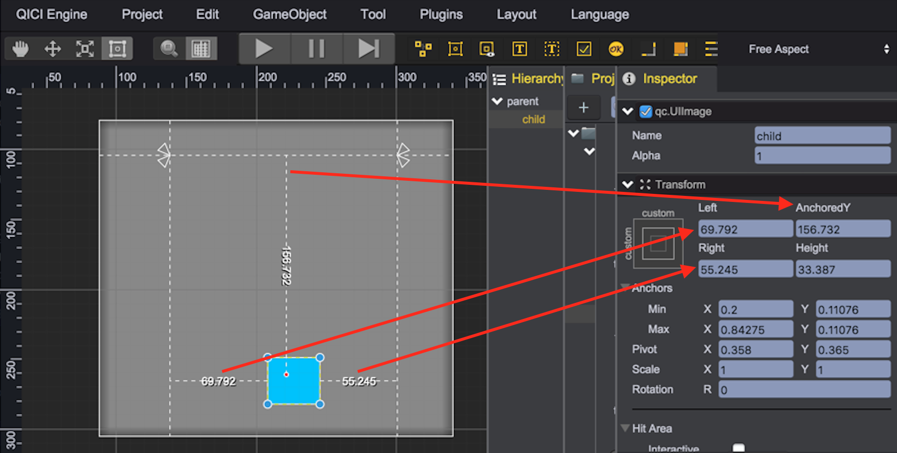

# Basic Layout
*Create an UIImage instance for testing, help you better understand the content of this chapter.*

## Transform
Every game object has a transform component, that determines the position, rotation, and scale of each game object in the scene.

The position, rotation and scale values are measured relative to game object's parent. If you haven't specified the parent, then game.world instance is the parent.

### Position
Horizontal and vertical offset of the game object's origin(pivot point) relative to it's parent's origin(pivot point)
* X - horizontal offset, node.x = 200
* Y - vertical offset, node.y = 100  


### Size
Width and height of the game object, see [Pivot](#pivot)
* Width - width, node.width = 200
* Height - height, node.height = 100  


### Pivot
Pivot determines the origin(pivot point) in the rectangle of game object self. The rotation and scale, including the children's position are all around the pivot point.
* Pivot X - horizontal position defined in percentage of the rectangle width，0.0 corresponds to the left side, 1.0 corresponds to the right side，node.pivotX = 0.2
* Pivot Y - vertical position defined in percentage of the rectangle height, 0.0 corresponds to the top side, 1.0 corresponds to the bottom side, node.pivotY = 0.5


### Rotation
The rotation value around the [pivot point](#pivot) of the game object.
* Rotation - The rotation around in radians, node.rotation = Math.PI/4


### Scale
The scale value around the [pivot point](#pivot) of the game object.
* Scale X - horizontal scale, node.scaleX = 0.5
* Scale Y - vertical scale, node.scaleY = 1  


### Transform Sample
Create an UIImage object in scene, set transform values as below:  


You can get the same result by running the code below in browser console:
````javascript
    var node = new qc.UIImage(G.game);
    node.texture = G.game.assets.find('__builtin_resource__');
    node.frame = 'empty.png';
    node.colorTint = new qc.Color(0xffff0000);
    node.x = 100;
    node.y = 100;
    node.width = 100;
    node.height = 100;
    node.rotation = -Math.PI/4;
    node.scaleX = 2;
    node.scaleY = 1;
    node.pivotX = 0.5;
    node.pivotY = 0;
````

## Rect Transform
Rect Transform is the layout counterpart of the [Transofrm](#transform). Where Transform represents a single point, Rect Transform represents a rectangle that a game object can be placed inside.
See demo: [recttransform](http://engine.qiciengine.com/demo/Layout/recttransform/index.html)

### Anchors
Rect Transform includes a layout concept called anchors, they are minAnchor and maxAnchor properties on game object, minAnchor corresponds to the left-top corner of the parent, maxAnchor corresponds to the right-bottom corner of the parent.

By default, minAnchor.x, minAnchor.y, maxAnchor.y and maxAnchor.y are all 0.0, they are both anchoring to the left-top corner of the parent, so you treat that as Rect Transform is disabled.

The anchor point values are defined as a percentage of the size of the parent rectangle. 0.0(0%) corresponds to the left or top side, 0.5(50%) corresponds to the center, 1.0(100%) corresponds to the right or bottom side.

*minAnchor.x, minAnchor.y, maxAnchor.x and maxAnchor.y are for getting, if you want to change them, use [setAnchor](http://docs.qiciengine.com/api/gameobject/node_setAnchor.html) method.*

In [Transform](../Interface/ToolBar.html#transform) toolbar, select the last button, then anchors are shown as four small triangular handles in the Scene, you can change them directly by dragging,

*When minAnchor and maxAnchor have the same value，i.e., they coincide, then you can drag from the center to move the four small triangular handles together.*

### Stretch
In Rect Transform layout, except for using minAnchor and maxAnchor to define the rectangle in parent object, you can use left, right, top and bottom to add padding inside the rectangle defined by the anchors.

*When dragging the four small triangular handles, you can press Shift button to keep left, right, top and bottom unchanged*

### AnchoredX and AnchoredY
The x and y mean the horizontal and vertical offset of the game object's origin(pivot point) relative to it's parent's origin(pivot point), they are different to anchoredX and anchoredY. When minAnchor.x is equal to maxAnchor.x, the anchoredX is the horizontal distance between the game object's origin(pivot point)'s x to the line on minAnchor.x or maxAnchor.x; When minAnchor.y is equal to maxAnchor.y, the anchoredY is the vertical distance between the game object's origin(pivot point)'s y to the line on minAnchor.y or maxAnchor.y.

Normally x and y have no direct relationship with anchoredX and anchoredY, but when a game obect's minAnchor and maxAnchor is the same with its parent's pivot point, then x and y always have the same value with anchoredX and anchoredY.

Below screenshot, the gray parent node's pivot is (0.5,0.5), the blue child node's pivot is (0.2,0.2), with same minAnchor and maxAnchor (0.2. 0.2)  
  

In Inspector panel, the content of Transform will be changed according to the minAnchor and maxAnchor's value.

1 - minAnchor.x === minAnchor.y and maxAnchor.x === maxAnchor.y: anchoredX, anchoredY, width and height  


2 - minAnchor.x === maxAnchor.x and minAnchor.y !== maxAnchor.y: anchoredX, top, width and bottom  


3 - minAnchor.x !== maxAnchor.x and minAnchor.y === maxAnchor.y: left, anchoredY, right, height


### Rect Transform Sample


In the sample we create a Red object as parent and a Blue object as it's child, the Blue object makes use of Rect Transform to be placed inside Red object's rectangle and has left, right, top and bottom values as padding.  


You can get the same result by running the code below in browser console:
````javascript
    var node = new qc.UIImage(G.game, red);
    node.texture = G.game.assets.find('__builtin_resource__');
    node.frame = 'empty.png';
    node.colorTint = new qc.Color(0xff0000ff);
    node.setAnchor(new qc.Point(0.1, 0.5), new qc.Point(0.9, 0.9));

    // node.setStretch(left, right, top, bottom)
    node.setStretch(30, 30, 40, 40)

    node.left = 30;
    node.right = 30;
    node.top = 40;
    node.bottom = 40;

    node.pivotX = 0.5;
    node.pivotY = 0;
````

### Case 1
  
The game object anchored to the center of the parent, maintaining a fixed offset to the center.

### Case 2
  
The game object anchored to the right-bottom corner of the parent, maintaining a fixed offset to the right-bottom corner.

### Case 3
  
The game object with left corners anchored to left-bottom corner of the parent maintaining a fixed offset, and right corners anchored to the right-bottom corner of the parent maintaining a fixed offset.

### Case 4
  
The game object with left corners anchored to a certain percentage from the left side of the parent rectangle, and right corners anchored to a certain percentage from the right side of the parent rectangle.

### Anchor Presets
In the Inspector, the Anchor Preset button can be found in the upper left corner of the Transform panel. Clicking the button brings up the Anchor Presets dropdown. From here you can quickly select from some of the most common anchoring options. You can anchor the game object to the sides or middle of the parent, or stretch together with the parent size. The horizontal and vertical anchoring is independent:    
  
  
