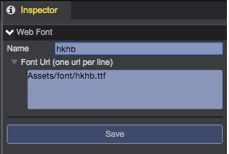
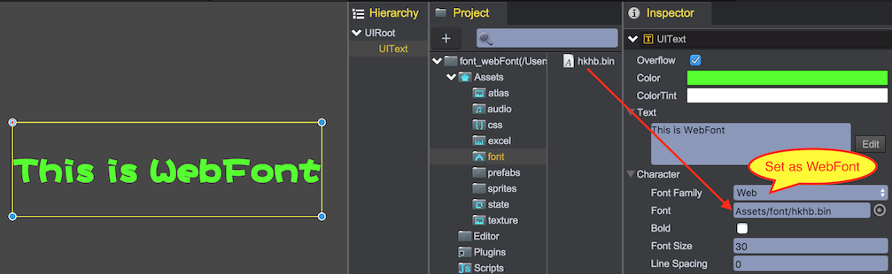

# Web Fonts
Normally we use the fonts that is installed on your local system, by using WebFont, we can use the fonts that are download from the remote server。

## Create WebFont Resource
1. Choose the main menu：Tool/Create WebFont
2. In Inspector panel, input font information:  
	  	
	* __Name__: Font name
	* __Font URLs__: Input the relative path in the project, or absolute path such as http://www.qiciengine.com/test.ttf		
3. Click "Save" to generate WebFont asset in "Assets/font" folder   
  

## Use WebFont
1. New scene, create a UIText component
2. Set "Font Family" as "Web"
3. Drag WebFont asset to set "Font" value  
	  

## Demo
[WebFont Demo](http://engine.qiciengine.com/demo/UIText/font_webFont/index.html)
