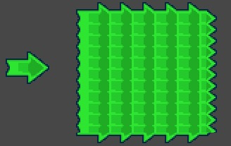

# qc.UIImage
inherit [qc.Node](CNode.md)

## 描述
显示2D图片的组件，游戏中的绝大部分图片应该使用本组件。

注意：本组件跟 [Sprite](CSprite.md) 的差别是，Sprite 作为精灵一般用于动画（例如帧动画、DragonBones骨骼动画），而 UIImage 是更纯粹的图元显示；另外 UIImage 中可以使用九宫格绘制，而 Sprite 没有。

## 创建 UIImage
````
    // 创建一个 Image 节点
    var image = new qc.game.add.image(parent);
````

## 变量
| 变量名        |  类型     |   作用           |
| ------------- |-------------| -------------|
| texture | qc.Atlas | 图片资源或图集 |
| frame | string | 具体的图片帧，在 texture 为图集的时候，可以指定该 frame 表示子图片，如果是普通图片而不是图集，frame设置无效（默认为 0） |
| nativeSize | qc.Rectangle | 只读，图片原始大小（不带任何缩放） |
| [imageType](image_imageType.md) | 枚举 | 图片显示的方式，包含三种：UIImage.IMAGE_TYPE_SIMPLE（简单缩放）、UIImage.IMAGE_TYPE_SLICED（九宫格缩放）、UIImage.IMAGE_TYPE_TILED（九宫格平铺），详见 [UIImage.imageType](image_imageType.md) |

## 方法
| 方法名 | 作用 |
| ------------- |-------------|
| [resetNativeSize](image_resetNativeSize.md) | 设置为图片原始的大小（图片不缩放） |

## 注意
图集建议通过我们自己的工具来进行打包以更好解决界面拼接有缝隙的问题。具体的打包方法是通过将图片归类到一个文件夹，并且文件夹的名字为 myAtlasName@atlas，后续就可以通过菜单--工具--打包图集来生成一个图集，这个图集的名字就是 myAtlasName，并放置在 Game/Assets/Atlas 目录下。

## 相关范例
````
// 创建两张图片，一张普通，一张九宫格拉升（九宫格数据是  L:15、R:15、T:15、B:15）
game.assets.load('ui', 'assets/sprites/ui.bin', function(data) {
    var image1 = game.add.image();
    image1.texture = game.assets.find('ui');
    image1.frame = 'arrow.png';
    image1.x = 100;
    image1.y = 100;
    image1.resetNativeSize();

    var image2 = game.add.image();
    image2.texture = game.assets.find('ui');
    image2.frame = 'arrow.png';
    image2.x = 200;
    image2.y = 30;
    image2.width = 200;
    image2.height = 200;
    image2.imageType = qc.UIImage.IMAGE_TYPE_TILED;
});
````
结果：



## 参考手册
[图片](http://docs.zuoyouxi.com/manual/Sample/UIImage.html)