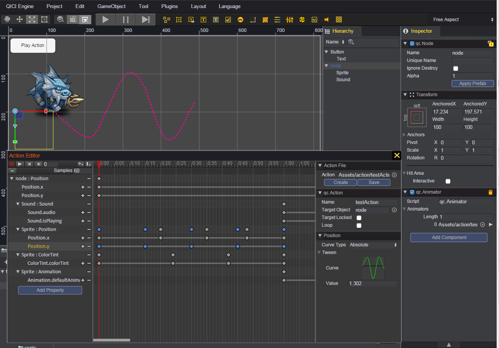
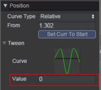
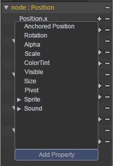
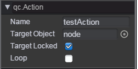
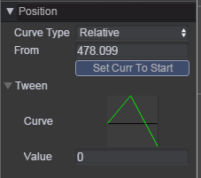
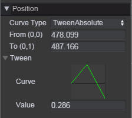
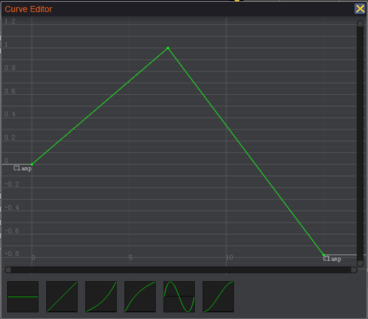
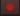
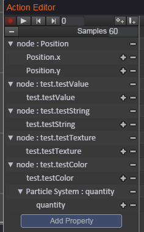

# 动作编辑器   
使用动作编辑器可直接创建和修改 _动作剪辑_ 文件，动作剪辑文件可以挂载到 [_Animator_](Animator.md) 组件中，实现相应的动作播放。
动作编辑器除了编辑标准的位移、旋转、缩放和序列帧动画以外，还支持各个对象和组件的属性编辑，支持多个参数的动画事件，可由设计人员自行编辑出复杂而细腻的动作。    

## 动作编辑器介绍  
可通过菜单 _Tool/Action Editor_，或双击 Assets/Action 目录下的 _动作剪辑_ 文件打开动作编辑器。以下是动作编辑器的界面截图：  
   
QICI编辑器的场景视图、Hierarchy视图、Inspector视图配合动作编辑器一起工作，用于显示动作编辑器的 _Target Object_对象当前帧的显示状态。  
动作编辑器分为左中右三个部分，以下依次进行介绍：  
* 动作编辑器左部是属性列表视图。  
     
  顶部有一些常用功能按钮，包括录制、播放、上一帧、下一帧、新增关键帧、新增事件；可设置每秒的帧数，以及显示和设置红色时间线所在的当前帧数。  
  
     
  下部是动作属性的列表。当没有加载 _动作剪辑_ 文件时，动作属性列表为空，属性列表视图的按钮都不允许点击。当加载 _动作剪辑_ 文件时，该 _动作剪辑_ 文件的动作属性列表会被列出。
如果这个动作控制多个子对象，这个动作属性列表也会按层次关系显示出子对象的动作属性。在上图中，Sound、Sprite 就为 node 的子节点。当 _Target Object_ 属性所指定的对象没有名字为 Sound 或 Sprite 的子节点，
相应的动作属性列表会以黄色字体显示，并提示 Missing。  
  每个动作属性的右侧有个减号，可以用来删除动作属性，每个具体属性的右侧有加减号，分别表示新增、删除该属性关键帧。  
  
       
  每个动作属性都能被展开和合并，展开后列出该动作属性具体的属性列表，选中具体的属性后，在动作编辑器的中部关键帧区域中，会以蓝色菱形显示出所有该属性的关键帧，并在动作编辑器右部属性面板中显示该属性当前帧的数值。
可以在属性面板中直接修改属性值，如果红色时间线正好在关键帧上，会直接修改该关键帧的属性值，如果红色时间线不在关键帧上，会在红色时间线位置创建一个新的关键帧，并赋上修改的属性值。  

    
  点击 _Add Property_ 按钮，会列出 _Target Object_ 属性所指定的对象以及其子对象的支持的动作属性列表，新增的动作属性，会在动作属性列表中显示出来。如果 _Target Object_ 属性没有指定对象，
点击 _Add Property_ 按钮，会弹出提示先设置 _Target Object_ 属性。   

* 动作编辑器中部是时间线视图。  
     
  顶部显示时间刻度，点击时间刻度可以设置当前帧，也可直接拖动时间刻度上的红方块来设置当前帧。_Target Object_ 属性所指定的对象在 QICI 编辑器场景中会显示出当前帧所对应的状态。  
  
     
  时间刻度的下一行是动作事件区域，动作事件帧显示在该区域。点击左侧的 _新增事件_ 按钮，会在红色时间线所在的位置新增一个动作事件帧。
  可以拖拽动作事件帧节点来移动该事件帧，若多个事件帧同时被选中，则多个事件帧会同时被移动。（可按下鼠标左键拖拽可选中多个事件帧）    
  右键点击事件帧节点，会弹出删除事件的菜单，可以删除该事件帧；右键点击动作事件帧区域的空白区域，会弹出新增事件的菜单，可以在鼠标点击的位置新增一个动作事件帧。   
  
     
  选中动作事件帧，在右侧的属性面板中会显示出事件编辑面板，可选择事件函数，及设置多个事件参数。   
  
     
  下部是关键帧区域，每个属性的关键帧都显示在该关键帧区域。动作属性列表展开后，具体属性的关键帧之间会有连线，列表合并后，显示的是该动作属性列表下的关键帧汇总。该区域可通过滚动鼠标滚轮进行放大或缩小时间轴的显示比例。
当显示区域超出时，会显示出右侧的垂直滑条和底部的水平滑条，可拖动滑条查看期望的显示区域。  
  选中关键帧，当前帧会切到该关键帧，相应的在右侧属性面板中，会显示出该关键帧的数值。可以拖拽关键帧节点来移动该关键帧，若多个关键帧同时被选中，则多个关键帧同时被移动。（可按下鼠标左键拖拽可选中多个关键帧）
  
  选中关键帧后，可以点击左侧该属性的减号来删除该关键帧，或右键点击关键帧，弹出删除关键帧的菜单，也可删除该关键帧；将红色时间线切到非关键帧位置，点击左侧该属性的加号或 _新增关键帧_ 按钮，可在红色时间线位置新增一个该属性关键帧，
或右键点击关键帧区域的空白区域，会弹出新增关键帧的菜单，可以在鼠标点击的位置新增一个关键帧。（关键帧的属性为鼠标位置所在行对应的属性）  
  
* 动作编辑器右部是属性面板视图，该视图分为上中下三个部分。  
    
  上部区域可用于创建、加载、保存 _动作剪辑_ 文件。  
  
    
  中部区域用于设置该动作的属性，有 Name、Target Object、Target Locked、Loop 四个属性。  
  Name 属性默认为 _动作剪辑_ 文件名。  
  Target Object 属性为播放该 _动作剪辑_ 的目标对象，没有设置该属性，无法播放该 _动作剪辑_。     
  Target Locked 属性表示是否锁定 Target Object 属性，若没有勾选，[_Animator_](Animator.md) 组件的 gameObject 对象会设置为该动作的 Target Object 属性值；若勾选了，则该 _动作剪辑_ 的 Target Object 属性值固定，不会被修改。  
  Loop 属性表示是否循环播放。  
  
       
  下部区域用于显示属性数值和动作事件的区域。属性数值面板主要有两种：数值曲线类型和关键帧类型。  
  若属性为数值时，采用的是数值曲线类型，可以编辑数值曲线，在下面的 [数值曲线类型介绍](#数值曲线类型介绍) 会进行介绍；若属性不为数值时（比如为图片帧），采用的是关键帧类型，该类型没有曲线编辑，如下图所示：   
      
    
## 数值曲线类型介绍  
### 曲线类型  
曲线类型有四种类型：
*  Absolute：曲线值为绝对值，为目标对象的属性值。以 x 属性为例，若曲线值为 110，则目标对象的 x 值为 110。       
*  Relative：曲线值是相对于 _From_ 值的偏移值，_From_ 值为目标对象的当前属性值，编辑器中点击 _Set Curr To Start_ 按钮，会以当前对象的属性值设置为该 _From_ 值，在游戏运行中，_From_ 值会随着目标对象的当前属性值而变。以 x 属性为例，若目标对象在第 0 帧的 x 值为 100，则 _From_ 值为 100，当曲线值为 10，则此时目标对象的 x 值为 100+10=110。  
*  TweenAbsolute：曲线值是 _To_ - _From_ 值的百分比值，_From_ 值为[曲线坐标图](#曲线编辑器) (0,0) 坐标表示的属性值，_To_ 值为[曲线坐标图](#曲线编辑器) (0,1) 坐标表示的属性值。以 x 属性为例，若 _From_ 值为 100，_To_ 值为 200，曲线值为 0.1，则目标对象的 x 值为 100+(200-100)*0.1=110。    
*  TweenRelative：曲线值是 _Distance_ 值的百分比值，_From_ 值规则与 _Relative_ 类型中的 _From_ 值相同。以 x 属性为例，若目标对象在第 0 帧的 x 值为 100，则 _From_ 值为 100，若 _Distance_ 值为 100，曲线值为 0.1，则此时目标对象的 x 值为 100+100*0.1=110。    
  
_其中的 TweenAbsolute 和 [Tween](../Tween/README.md) 组件类似，都有 From 和 To，曲线值一般在 0 到 1 之间。TweenAbsolute 和 TweenRelative 两种曲线类型，可以通过代码手动修改曲线参数 From、To，也与 [Tween](../Tween/README.md) 组件类似_
  
### 曲线编辑器
点击 Curve 曲线缩略图，会打开曲线编辑器，如下所示：  
   
曲线坐标系的 x 轴表示的是帧数，y 轴表示的是曲线值。   
在曲线编辑器中，可以新增、删除、移动关键帧，还可以修改各个关键帧的入角、出角值。曲线坐标系中的关键帧与时间线视图中的关键帧是一一对应的，在曲线编辑器中更改关键帧，都会在时间线视图中同时有所体现。  
  
## 使用动作事件  
在[动作编辑器介绍](#动作编辑器介绍)中已经介绍了如何新增、删除、移动动作事件帧。当选中动作事件帧节点，会显示出如下事件面板：   
   
点击 Function 的列表框，会列出目标对象挂载的所有脚本中的自定义函数，可支持多个函数参数，参数的类型为 String。当 Play In Editor 不勾选时，表示在动作编辑器上不触发动作事件。  
  
## 录制动作剪辑    
打开动作编辑器，默认处于录制状态，录制按钮显示为：。  
处于录制状态时，QICI编辑器场景中对象的属性变更会自动记录到 _动作剪辑_ 的相应属性中。在场景中移动、旋转、缩放对象，若 _动作剪辑_ 存在相应的动作属性，则会在红色时间线所在位置为相应属性新增关键帧或修改关键帧数值。也可以通过直接修改 Inspector 面板中的属性值来新增关键帧或修改关键帧数值。  
下面的视频为一个样例：在录制状态下通过移动对象创建对象的心形移动路径。  
<video controls="controls" src="../video/heartPath.mp4"></video>  
  
## 添加自定义动作属性
在动作编辑器中可添加自定义动作属性，自定义的属性可以是对象上的属性，也可以是对象挂载的脚本组件的属性。如下所示：  
````javascript
	// Add custom action properties
	qc.extend.addProperty('qc.Node', 'test.testValue', qc.Serializer.NUMBER);
	qc.extend.addProperty('qc.Node', 'test.testString', qc.Serializer.STRING);
	qc.extend.addProperty('qc.Node', 'test.testColor', qc.Serializer.COLOR);
	qc.extend.addProperty('qc.Node', 'test.testTexture', qc.Serializer.TEXTURE);
	qc.extend.addProperty('qc.ParticleSystem', 'quantity', qc.Serializer.NUMBER);
````
以上代码演示了添加 4 个 test 脚本组件的属性和 1 个 qc.ParticleSystem 对象的属性。在动作编辑器中可以添加上述的动作属性，如图所示：  
   
  
下面介绍 qc.extend.addProperty 的各个参数：  
第1个参数：动作属性的 gameObject 对象的类名，若属性为组件的属性，则为组件的 gameObject 对象的类名。  
第2个参数：动作属性名。支持级联格式 "xxx.yyy.zzz"，以 qc.Demo.Test 组件的 testValue 属性为例，可传入 Test.testValue 字符串作为动作属性名。  
第3个参数：动作属性类型。目前默认支持 qc.Serializer.NUMBER、qc.Serializer.STRING、qc.Serializer.BOOLEAN、qc.Serializer.COLOR、qc.Serializer.AUDIO、qc.Serializer.TEXTURE 这几种类型。  

## 使用脚本控制动作  
[_Animator_](Animator.md) 组件提供了一些常用的动作控制函数，可以通过获得对象节点的 Animator 组件来控制动作。  
### 播放  
````javascript
	// Animator's gameObject play first action
	this.gameObject.Animator.play();
	
	// Animator's gameObject play second action
	this.gameObject.Animator.play(1);
	
	// Animator's gameObject play test action
	this.gameObject.Animator.play('test');
	
	// Animator's gameObject play test2 action
	this.gameObject.Animator.play('test2');
	
	// Ob object play test actoin 
	this.gameObject.Animator.play('test', Ob);
````  
同一个 [_Animator_](Animator.md) 组件，可以同时播放多个不同的动作，但相同的动作同时只能播放一个。  

### 停止
````javascript
	// play test action
	this.gameObject.Animator.play('test');
	
	// stop test action
	this.gameObject.Animator.stop('test');
	
	// resume test action
	this.gameObject.Animator.play('test', null, false);
````  
动作停止时，若要继续从停止位置播放动作，则在调用 play 方法时给第三个参数传入 false。  

### 修改动作曲线参数  
````javascript
	// get test action
	var action = this.gameObject.Animator.getAction('test');
	
	// If curveType of x attrib is TweenAbsolute in the action clip, we can set from、to parameters for the action 
	action.setData('/', qc.PROP_POSITON, 'x', { from : 0, to : 100 });
	
	// If curveType of x attrib is TweenRelative in the action clip, we can set to parameters for the action 
	action.setData('/', qc.PROP_POSITON, 'x', { to : 100 });
	
	// play test action
	this.gameObject.Animator.play('test');
````  
qc.Action 的 setData 方法请查看下面的 API 文档说明。  

### 修改动作属性  
````javascript
	// get test action
	var action = this.gameObject.Animator.getAction('test');
	
	// set loop  
	action.loop = true;
	
	// set samples  
	action.samples = 60;
	
	// play test action
	this.gameObject.Animator.play('test');
````  

### 关注动作播放完毕的事件  
````javascript
	// get test action
	var action = this.gameObject.Animator.getAction('test');
	
	// The event is triggered when action is finished.  
	action.onFinished.add(function(action) { consolo.log('action is finished.'); } );
	
	// The event is triggered when every loop is finished.  
	action.onLoopFinished.add(function(action) { consolo.log('action is loop finished.'); } );
	
	// play test action
	this.gameObject.Animator.play('test');
````  

## API
[Action API](http://docs.zuoyouxi.com/api/action/Action.html)

## Demo
[Action Demo](http://engine.zuoyouxi.com/demo/index.html#anchor_Action)