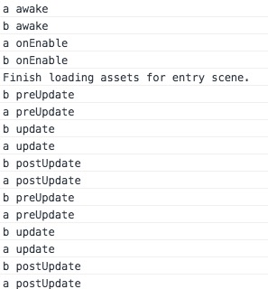

# 事件函数执行顺序

行为脚本代码有很多事件函数，在运行中这些事件函数会按预先设定的顺序进行执行，执行顺序如下所述：

## 演示的代码
1. 在Scripts目录下新建脚本：CallTest.js

````javascript
var CallTest = qc.defineBehaviour('qc.demo.CallTest', qc.Behaviour, function() {

}, {
    // 需要序列化的字段
});

CallTest.prototype.awake = function() {
    console.log(this.name, 'awake');
};

CallTest.prototype.onEnable = function() {
    console.log(this.name, 'onEnable');
};

CallTest.prototype.onDisable = function() {
    console.log(this.name, 'onDisable');
};

CallTest.prototype.preUpdate = function() {
    console.log(this.name, 'preUpdate');
};

CallTest.prototype.update = function() {
    console.log(this.name, 'update');
};

CallTest.prototype.postUpdate = function() {
    console.log(this.name, 'postUpdate');
};
````

2. 在场景中新建2个空的场景节点，分别取名位'a'、'b'，并分别挂载CallTest脚本		  
3. 运行之，查看控制台打印结果	
	  	
4. 将组件disable掉，再查看打印结果	
		

## 调用顺序
1. awake
2. onEnable
3. preUpdate
4. update
5. postUpdate