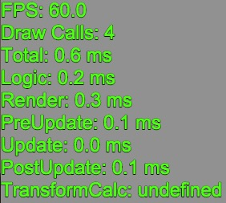

# 调试信息显示

qc.DebugViewer可以挂载在Text或者DOM组件上，以查看帧率、调度的时间消耗等（正式发布时需要隐藏）。如下图：  
  
* __FPS__ - 游戏运行帧率
* __Draw Calls__ - 在WebGL渲染模式下起效
* __Total__ - 一次主循环耗时（Logic + Render）
* __Logic__ - 主循环中的逻辑调度耗时（PreUpdate + Update + postUpdate）
* __Render__ - 渲染耗时  

````javascript
nodeMask = text.addScript('qc.DebugViewer');
````

## Inspector面板
  
* __Debug On：__  调试是否打开，打开后trace日志将会被输出到控制台
* __Duration：__  统计的时间长度，每Duration秒统计1次   

## 范例
[DebugView](http://engine.zuoyouxi.com/demo/index.html#anchor_Debug)
