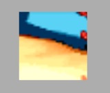

# 节点遮罩

节点遮罩组件：qc.NodeMask，用来对方节点的子孙进行裁剪显示。

````javascript
nodeMask = node.addScript('qc.NodeMask');
````

## 裁切模式  
1. __矩形遮罩：__ 只显示指定节点大小的矩形范围，超出矩形区域不显示
````javascript
nodeMask.mode = qc.NodeMask.MODE_DEFAULT;
````

2. __通道图遮罩：__ 使用一张图片作为遮罩，透明或图片范围外的区域被裁切
````javascript
nodeMask.mode = qc.NodeMask.MODE_PIXEL;
````

|矩形遮罩|通道图遮罩（圆）|
|:-----:|:-----:|
|||

## 通道图遮罩案例
1. 构建两个UIImage，父亲为QICI，孩子为Sun
2. 在父亲节点上通过添加"UI/NodeMask"组件
3. 在Inspector上将NodeMask组件的"Clip Mode"属性设置为"Pixel"  


## Demo
[NodeMask](http://engine.zuoyouxi.com/demo/index.html#anchor_Mask)
