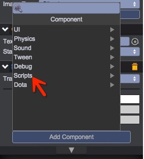

# 组件菜单自定义
默认情况下，点击Add Component添加组件时，脚本逻辑组件都统一放置在Scripts子菜单下：  
  

如果要更改脚本组件的显示位置，可通过设置类的__menu属性实现。
示例代码如下：  
````javascript
var TestEditor = qc.defineBehaviour('qc.demo.TestEditor', qc.Behaviour, function() {
}, {
});

// 设置__menu属性自定义qc.demo.TestEditor脚本组件的显示位置
TestEditor.__menu = 'Demo/Test';
````
