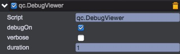
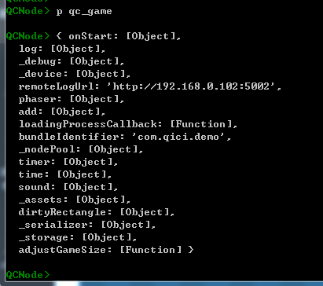
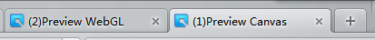
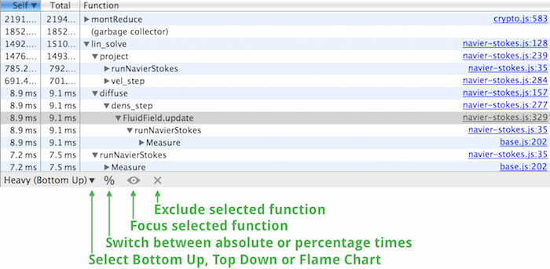

# 调试与优化

1. 新增UIText节点（或DOM节点），调整位置和大小。置于界面的某个位置   
2. 在UIText节点挂载[Debug/DebugViewer](../BuildinComponents/DebugViewer.html)组件  
     
      

注意：在桌面系统默认帧率为60，在移动终端默认帧率为30，可通过game.time.frameRate获取和设置帧率。
另外在编辑状态为提高操作体验，StartScene.templet.html中将帧率设置为了30。

## 远程控制台调试  
在引擎编辑器 nodejs 控制台上，可与客户端进行 js 指令交互，查看或设置客户端的 js 变量，对调试手机端的游戏尤其方便。以下截图为查询 qc_game 实例的情况：  
   
备注：引擎编辑器 nodejs 控制台及[简易服务器](http://docs.zuoyouxi.com/manual/Plugin/server.html) 提供了前后端的控制台交互功能。  

### 一、开启方式
1、发布环境下，在 StartGame.html 的 config 中增加 remoteLogUrl 字段，配置上引擎编辑器 nodejs 服务器地址（比如：http://115.159.121.224:5002 ），即可在引擎编辑器 nodejs 控制台上与客户端进行交互。上述 url 地址需要修改成自已的 url。    
````javascript
	qici.config.remoteLogUrl = 'http://115.159.121.224:5002';
````  
2、Preview 模式下，生成的 PreviewGameCanvas.html 或 PreviewGameWebGL.html 中的 config 已自动配置上了 remoteLogUrl 字段，可直接在引擎 nodejs 控制台进行交互操作。  

### 二、调试方式  
1、与单个客户端交互时，直接通过 p 指令进行交互，如下所示：  
  
2、与多个客户端交互时，有两种方式进行交互：  
* 先使用 use 指令，切换客户端 id；再使用 p 指令进行交互，如下：  
   
__其中客户端 id 显示在页面 title 中__，如下：   
     
* 使用 p%id% 指令进行交互，如下：    
   
3、use 0 指令的特殊作用：之前使用过 use 指令切换过客户端 id，之后需要与单一客户端进行交互时，可直接使用 use 0 指令，然后使用 p 指令进行交互。   
   

### 三、远程日志    
按上述开启方式配置上 remoteLogUrl 后，使用 [game.log](http://docs.zuoyouxi.com/api/log/index.html) 中的接口来输出日志，这些日志会显示在引擎编辑器 nodejs 控制台上。  
   

## 第三方工具

我们推荐使用Chrome浏览器内置的调试工具[Chrome DevTools](https://developers.google.com/web/tools/chrome-devtools/)，进行内存和网络等性能调试优化。   


## Demo
[DebugView Demo](http://engine.zuoyouxi.com/demo/Debug/debug_info/index.html)    