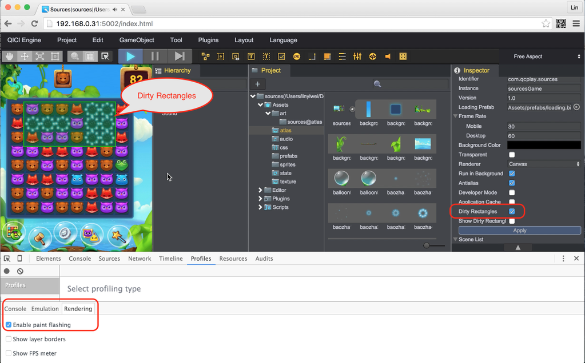

# 脏矩形
在使用Canvas模式进行渲染绘制时，每帧绘制的图形数量直接影响渲染效率。而对于部分游戏而言，相比上一帧，变化的元素有限，如果只更新这部分变化的元素，将大大提高渲染效率。为此，引擎为Canvas渲染提供了脏矩形支持。

## 启用脏矩形
在游戏中启用脏矩形有如下2种方式：  
* 在[工程设置](../Settings/README.md)中，设置启用脏矩形。
* 在代码中使用  
````javascript
this.game.dirtyRectangle.enable = true;
````
启用脏矩形。

## 显示脏矩形更新区域
在游戏中，如果需要检查更新区域，可以通过如下3种方式开启在游戏运行中动态显示脏矩形区域：  
* 在[配置](../Settings/README.md)中，设置显示脏矩形更新区域。
* 在代码中使用
````javascript
game.dirtyRectangle.showDirtyRegion = true;
````
* 通过开启Google Chrome浏览器的"Enable paint flashing"选项
  

## 强制更新整个屏幕内容
有时候，会需要强制更新整个屏幕的内容，这个时候可以通过  
````javascript
this.game.dirtyRectangle.forceDirty = true;
````
来设置当前帧，强制更新整个屏幕的内容。
