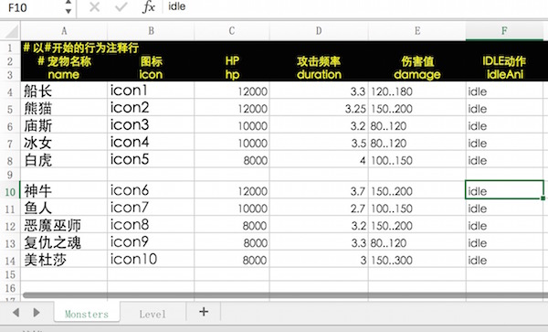

# 使用Excel
Excel表格数据对策划是非常友好的，而且是高度可定制化的。因此我们强烈建议广大开发者能够使用好这个工具，千万千万别把一堆游戏配置相关的数据写到代码中：提供一张excel表吧，让策划搞定。

## 支持的Excel数据格式
  
* 以'#'开头的为注释行，解析时会忽略掉
* 第一个非注释行、非空行为列的名称
* 后续为配置内容，支持公式运算
* 支持多个sheet

## 导入Excel文件
直接将excel表（后缀名为.xlsx）拖入Project的Assets目录就可以了

## 完整的使用例子
1. 建立一个excel文件：config.xlsx，里面包含了2个sheet，内容等如下图所示：  
    
    
2. 文件放入工程目录：Assets/excel/
3. 编写代码访问此配置信息。新增脚本：ExcelTest.js：
````javascript
	var ExcelTest = qc.defineBehaviour('qc.demo.ExcelTest', qc.Behaviour, function() {
	}, {
	    // 需要序列化的字段
	});

	// 初始化处理
	ExcelTest.prototype.awake = function() {
	    // 加载excel配置表信息
	    var self = this;
	    self.game.assets.load('config', 'Assets/excel/config.bin', function(data) {
	        // data为qc.ExcelAsset类型的数据
	        console.log('Download OK.', data);

	        // 做一些读取演示的demo
	        self.read();
	    });
	};

	// 读取演示
	ExcelTest.prototype.read = function() {
	    // 获取下载的内容
	    var data = this.game.assets.find('config');

	    console.log('sheets', data.sheetsName);

	    // key为sheets名称，value为数据表(类型qc.ExcelSheet)
	    console.log('datas', data.sheets);

	    // 读取monsters表
	    var monsters = data.findSheet('Monsters');
	    console.log('column name', monsters.columns);
	    console.log('lines', monsters.rows);

	    // 将数据转换为以name为key的数值对
	    var o = {};
	    monsters.rows.forEach(function(row) {
	        o[row.name] = row;
	    });
	    console.log('formated data', o);
	};
````
4. 将此脚本组件挂载到任何Node节点，并运行。查看控制台打印以理解各接口的用法

## API
更多的功能请查阅API相关文档
* [ExcelAsset](http://docs.zuoyouxi.com/api/assets/ExcelAsset.html)
* [ExcelHashSheetIndex](http://docs.zuoyouxi.com/api/assets/ExcelHashSheetIndex.html)
* [ExcelSortSheetIndex](http://docs.zuoyouxi.com/api/assets/ExcelSortSheetIndex.html) 

## Demo
[Excel Demo](http://engine.zuoyouxi.com/demo/misc/excel/index.html)      