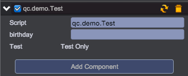

# 扩展属性监视面板(Inspector)

1. 新建工程，在Editor目录下新建脚本Test.js，添加扩展代码：

```javascript
// 脚本显示扩展
// 第一个参数为自定义的脚本组件类名
// 第二个参数为重载的绘制函数
G.extend.inspector('qc.demo.Test', function() {
    var self = this,
        target = self.target;

    // 先调用默认的绘制方法
    self.defaultDraw();

    // 调用自己的绘制
    var gui = qc.editor.gui;
    gui.columnWidths = ["70+0.1", "60+0.5"];
    gui.line([
        gui.text('Test'),
        gui.text('Test Only')
    ]);
});
```

2. 在Scripts下创建JS文件：Test

```javascript
qc.defineBehaviour('qc.demo.Test', qc.Behaviour, function() {
	this.birthday = '19811001';
}, {
    // 定义一个可序列化且可在Inspector面板可见的属性字段
    birthday: qc.Serializer.STRING
});
```

3. 刷新页面，并在场景中新建个空节点，挂载Test脚本
4. 选中此节点，查看Inspector的显示结果：  	


## GUI使用

* [GUI布局](Layout.md)
* [GUI组件](Component.md)


