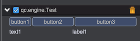

# GUI布局

GUI使用表格式布局，在这种布局下，组件可以显示在预定义的单个单元格中，也可以跨单元格显示(跨行、跨列)。

*qc.editor.gui是个全局对象，后续简称为gui*

## gui.columnWidths

指定面板中一共有几列。`在创建组件之前`，必须先设置此属性。

```javascript
// 下面的代码中，将面板划分为三列
// 第一列固定宽度50px
// 第二列最小宽度60px，权重值为0.1
// 第三列最小宽度50px，权重值为0.3
// 权重值控制当面板宽度大于列宽度之和时，多余的宽度如何分配
// 比如面板总宽度为200px，三列一共占用了50+60+50=160px，多出来的40px按照1:3的比例分配给第二列和第三列
// 即：第二列最终宽度为60+10=70px，第三列最终宽度为50+30=80px，而第一列因为没有权重值，宽度固定为50px
gui.columnWidths = [50, '60+0.1', '50+0.3'];
```

有意思的是，在绘制面板的过程中可以随时改变columnWidths，如下面的代码：
```javascript
// 先绘制三列
gui.columnWidths = [60, '60+0.1', '50+0.3'];
gui.line([
	gui.button('button1'),
	gui.button('button2'),
	gui.button('button3')
]);
// 再绘制两列
gui.columnWidths = ['10+0.1', '10+0.1'];
gui.line([
	gui.text('text1'),
	gui.label('label1')
]);
```
运行效果：



需要注意，应该尽量避免采用这种方式。
对编辑器来说，每次声明columnWidths都要创建一个新的面板组件，而面板多了会影响编辑器性能。
如果遇到上面这种需求，可以采用跨行、跨列实现(下面有介绍)。

## gui.line(columns, height)

在面板中新增一行组件

参数说明：

* __columns__: 数组类型，内部组件列表
* __height__: 整数类型，表示行高度，默认值为20(可选)

```javascript
// 一定要先声明列信息
gui.columnWidths = [60, '60+0.1', '50+0.3'];

// 增加一行，因为上句代码声明了三列，所以这一行里要放三个组件，每个组件占用一列
gui.line([
	gui.button('button1'),
	gui.button('button2'),
	gui.text('normal text')
]);

// 新增一行，这行只有两个组件，因为第一个按钮通过colspan跨了两列
gui.line([
	gui.button('button1', {}, {colspan: 2}),
	gui.button('button2')
]);	
```
运行效果：


## gui.titleLine(title, collapsed)

在面板中新增一个标题行。标题行可以增加多个普通行，进行展开合并操作

参数说明：

* title 字符串类型，标题文字
* collapsed 布尔类型，是否合并标题栏，默认为false(可选)

返回值：一个JavaScript对象，只有一个add方法，用于增加普通行

```javascript
// 一定要先声明列信息
gui.columnWidths = [60, '60+0.1', '50+0.3'];

var titleLine = gui.titleLine('TitleLine');
// 为titleLine增加第一个普通行
titleLine.add(gui.line([
	gui.button('button1'),
	gui.button('button2'),
	gui.text('normal text')
]));
// 为titleLine增加第二个普通行
titleLine.add(gui.line([
	gui.stringInput(),
	gui.button('button'),
	gui.stringInput()
]));
```
运行中的展开效果：


运行中的合并效果：


