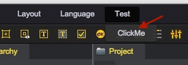

# 主菜单扩展

1. 在Project面板中，创建脚本：Assets/Editor/ExtendEditor.js
````javascript
// 菜单扩展
// 第一个参数指明主菜单的路径，使用/进行分割
// 第二个参数表示当菜单被点击时的处理逻辑，以下代码中弹出一个提示框
G.extend.menu('Test/ClickMe', function() {
    alert('Welcome!');
});
````
2. 刷新页面，查看效果  
	  
	
## Demo
[Extend-menu Demo](http://engine.zuoyouxi.com/demo/misc/extend_editor/index.html)    