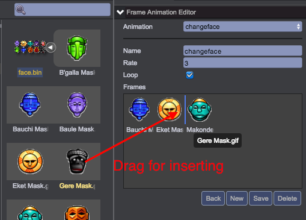

# 编辑帧动画
1. 在Project面板中，选择帧动画所在的图集  
2. 在Inspector面板中显示了图集的信息，点击“Editor Frame Animation”按钮：  
	  
3. 在帧动作编辑器中，选择“New”按钮，添加动作
4. 输入动作名称，帧率，是否循环播放，并添加每帧的图片  
      
5. 编辑完毕后，记得点击“Save”按钮保存    

*说明：在编辑时，预览窗口可实时预览哦*  

视频演示：  
<video controls="controls" src="../video/create_frame_animation.mp4"></video>  