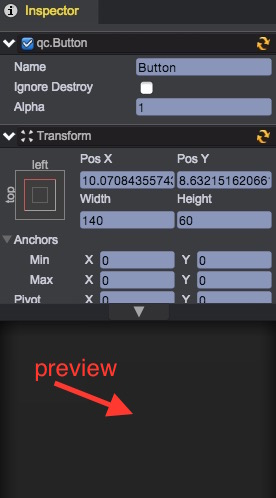

# 属性监视（Inspector）面板
  

游戏场景是由多个游戏对象组成，游戏对象包含位置、大小、图片、声音、脚本等诸多属性，监视面板就是用来显示当前场景选中的游戏对象详细属性信息，包括所有挂载在该游戏对象的组件属性。

任何显示在监视面板的属性可运行时直接修改，在脚本中甚至可以自定义要显示在监视面板的属性：[扩展Inspector](../ExtendEditor/Inspector.html)

除了游戏对象属性外，监视面板还用于显示项目（Project）面板中的选中资源信息，包括[帧动作编辑](../FrameAnimation/index.html)，资源导入，[工程设置](../Settings/index.html)，插件管理等工具。