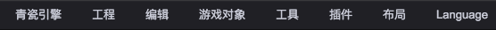

# 主菜单 
  
此菜单项的内容可以被动态扩展，见：[扩展主菜单](../ExtendEditor/Menu.md)

* __青瓷引擎__
	* __关于青瓷引擎__ - 导航到 http://www.zuoyouxi.com/
	* __检测更新__ - 检测编辑器是否有新版本
	* __帮助__ - 导航到在线手册、API文档和论坛
	* __偏好设置__ - 设置编辑器偏好
* __工程__
	* __新场景__ - 创建新的场景
	* __保存场景__ - 保存当前场景
	* __刷新场景__ - 重新载入场景
	* __打开最近工程__
	* __新建工程__
	* __打开工程__
	* __发布__ - 发布工程
	* __设置__ - 工程项目的设置
* __编辑__
	* __回退__ - 回退上次操作
	* __重做__ - 重做上次操作
	* __剪切__ - 剪切选中节点
	* __拷贝__ - 拷贝选中节点
	* __粘贴__ - 粘贴节点
	* __复制__ - 复制粘贴节点	
	* __删除__ - 删除节点
	* __预览 (WebGL)__ - 使用WebGL模式在独立页面预览游戏
	* __预览 (Canvas)__ - 使用Canvas模式在独立页面预览游戏
	* __运行__ - 运行（或退出运行）游戏
	* __应用预制修改__ - 将选中节点的修改保存到对应预制文件
* __游戏对象__
	* __空节点__ - 创建空节点
	* __图片__ - 创建图片节点
	* __精灵__ - 创建精灵节点
	* __文本__ - 创建文本节点
	* __按钮__ - 创建按钮节点
	* __开关__ - 创建开关节点
	* __滚动条__ - 创建滚动条节点
	* __滚动视图__ - 创建滚动视图节点
	* __进度条__ - 创建进度条节点	
	* __拉条__ - 创建拉条节点
	* __输入框__ - 创建输入框节点
	* __音效__ - 创建声音节点
	* __Dom节点__ - 创建Dom节点
	* __绘图__ - 创建Graphics节点，用来绘制基础几何图形
	* __UIRoot__ - 创建UI根节点
	* __瓦片地图__ - 创建瓦片地图节点	
* __工具__
	* __帧动画编辑器__ - 打开帧动作编辑器
	* __资源导入__ - 打开资源导入工具
	* __重打包图集__ - 重新打包所有图集
	* __创建WebFont__ - 创建WebFont资源
* __插件__
	* __插件管理__ - 打开插件管理工具
	* __插件商店__ - 打开在线插件商店
	* __导出插件__ - 导出打包插件
* __布局__
	* __竖屏__ - 竖屏布局
	* __横屏__ - 横屏布局
* __Language__
    * __中文__ - 切换到中文语言版本
    * __English__ - 切换到英文语言版本	
		