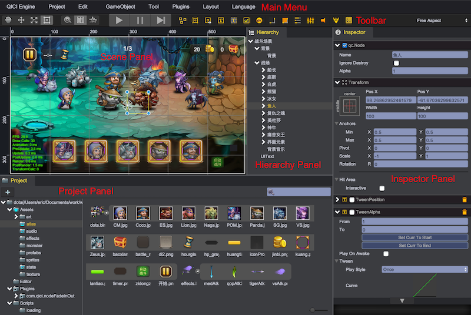

# 编辑器界面总览
  

编辑器分为如下几个面板：
* [主菜单 (Main Menu)](MainMenu.md)
* [工具栏 (Toolbar)](ToolBar.md)
* [场景、游戏面板 (Scene Panel)](Scene.md)
* [层次树面板 (Hierarchy Panel)](Hierarchy.md)
* [工程面板 (Project Panel)](Project.md)
* [属性监视面板 (Inspector Panel)](Inspector.md)
