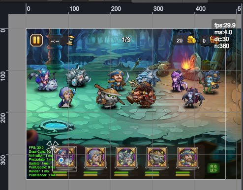
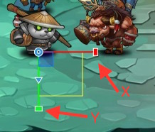

# 场景、游戏面板
  

## 功能描述
  * 在非运行状态，用来编辑和展示场景的内容；
  * 在运行状态，此窗口作为游戏的容器

## 操作
  * 场景中有个白色的矩形框，表示设备屏幕窗口的边界
  * 通过与工具栏的Transform工具配合，实现对场景节点的移动、缩放、定位等，具体的操作请创建个UIImage进行体验
    
    * __移动__（使用鼠标或方向键操作）    
      
    视频演示：  
    <video controls="controls" src="../video/oper_move_node.mp4"></video>  

    * __缩放__  
      	  
    视频演示：  
    <video controls="controls" src="../video/oper_scale_node.mp4"></video>  

    * __锚点、大小__  
      
    视频演示：  
    <video controls="controls" src="../video/oper_size_node.mp4"></video>  	
