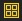
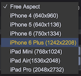

# 工具栏
  

工具栏的操作主要分如下5块：
## Transform操作  
   
从左到右依次为：
1. __手抓图__ - 移动画布，快捷键：__Q__
2. __移动__ - 改变节点的坐标，快捷键：__W__
3. __缩放__ - 改变节点的缩放比例，快捷键：__E__
4. __锚点和大小__ - 改变节点的锚点、大小等，快捷键：__R__    		

## 辅助功能
  
从左到右依次为：
1. 缩放场景到适合窗口显示，快捷键：__T__
2. 显示/隐藏标尺。快捷键：__Y__

## 运行与调试
  
从左到右依次为：
1. __运行(或推出运行)游戏__
2. __暂停游戏__
3. __逐帧运行游戏，每点击一次前进一帧__

## 添加游戏对象
      
从左到右依次为：  
* __空节点__  - 创建空节点
* __图片__  - 创建图片节点
* __精灵__  - 创建精灵节点
* __文本__  - 创建文本节点
* __输入框__  - 创建输入框节点
* __开关__  - 创建开关节点        
* __按钮__  - 创建按钮节点
* __滚动条__  - 创建滚动条节点
* __滚动视图__  - 创建滚动视图节点
* __进度条__  - 创建进度条节点 
* __拉条__  - 创建拉条节点
* __Dom__  - 创建Dom节点
* __音效__  - 创建声音节点
* __瓦片地图__  - 创建瓦片地图节点

## 分辨率设置
  
可以选择主流的手机分辨率，如果是Android系统下请选择与选项中相近的分辨率，或者使用"Free Aspect"选项
