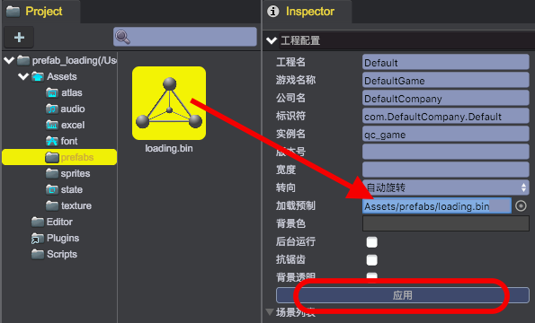
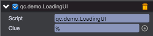

# 场景加载界面

友好的游戏场景加载界面可让用户直观了解当前游戏资源加载进度，在此我们利用[预制](../Prefab/index.html)章节制作的预制资源，改进为场景加载动画效果：

  

## 加载进度提示
1. 打开[工程配置](../Settings/index.html)，在Inspector面板设置'加载预制'值为'Assets/prefabs/loading.bin'，记得点击'应用'按钮。	
 
2. 对'loading'对象增加Tween/TweenAlpha组件，设置Duration值为1：		
 
3. 对'loading'对象挂载LoadingUI.js脚本，设置脚本属性clue与UIText文本对象'%'关联:	
 	

````javascript
var LoadingUI = qc.defineBehaviour('qc.demo.LoadingUI', qc.Behaviour, function() {
    this.clue = null;
}, 
{
    clue: qc.Serializer.NODE
});

LoadingUI.prototype.awake = function() {
    var self = this;
    // 开始加载场景时显示预制
    self.game.scene.onStartLoad.add(function() {            
        self.show();
    });
    // 场景加载完毕时隐藏预制
    self.game.scene.onEndLoad.add(function() {            
        if (self.gameObject.visible) { 	        	
            var tweenAlpha = self.gameObject.getScript('qc.TweenAlpha');                
            if (tweenAlpha.enable) {
            	// 如果动画还未结束，则设置标志，在动画结束后再隐藏
                tweenAlpha._hideOnFinished = true;
            }
            else {
                self.hide();    
            }                
        }
    });
};

LoadingUI.prototype.update = function() {
    var self = this,
        loaded = self.game.assets.loaded,
        total = self.game.assets.total;

	// 更新资源加载进度文字
    self.clue.text = 'Hardly Loading: ' + loaded + '/' + total;

    // 将预制设置到最上层，避免被游戏对象遮挡
    var parent = self.gameObject.parent;
    parent.setChildIndex(this.gameObject, parent.children.length - 1);
};

// 显示预制
LoadingUI.prototype.show = function() {
    var self = this, tweenAlpha = self.gameObject.getScript('qc.TweenAlpha');
    self.gameObject.alpha = 0;
    self.gameObject.visible = true;
    tweenAlpha.from = 0;
    tweenAlpha.to = 1;
    tweenAlpha.stop();  
    tweenAlpha.resetToBeginning(); 
    tweenAlpha.onFinished.addOnce(function() {
        if (tweenAlpha._hideOnFinished) {
            tweenAlpha._hideOnFinished = false;
            self.gameObject.visible = false;                    
        }            
    });             
    tweenAlpha.playForward();
 
};

// 隐藏预制
LoadingUI.prototype.hide = function() {
    var self = this, tweenAlpha = self.gameObject.getScript('qc.TweenAlpha');
    self.gameObject.alpha = 1;
    tweenAlpha.from = 1;
    tweenAlpha.to = 0;
    tweenAlpha.stop();
    tweenAlpha.resetToBeginning();         
    tweenAlpha.onFinished.addOnce(function() {            
        self.gameObject.visible = false;
    });
    tweenAlpha.playForward();
};
````
## 场景切换

从运行游戏的HTML页面源码可知，通过工程中设置加载预制创建的游戏对象的ignoreDestroy属性被设置为true，该属性使得加载界面的游戏对象在切换游戏场景时不会被析构，只不过在场景加载过程才显示，加载后就被隐藏了，因此对于场景切换的例子，我们唯一需要做的仅仅是构建几个场景，并提供切换场景的触发动作。

我们分别构建了RedState、YellowState和BlueState三个场景，每个场景都有对应颜色的UIImage填充满画面作为背景，中间具有一个切换到下一个场景的按钮，三个按钮共享同一个NextState.js脚本:	

````javascript
var NextScene = qc.defineBehaviour('qc.demo.NextScene', qc.Behaviour, function() {
    this.scene = '';
}, 
{
    scene: qc.Serializer.STRING
});
NextScene.prototype.onClick = function() {
	this.game.scene.load(this.scene);        
};
````
 	

## Demo
[Prefab Demo](http://engine.zuoyouxi.com/demo/Prefab/prefab_loading/index.html)    
      
