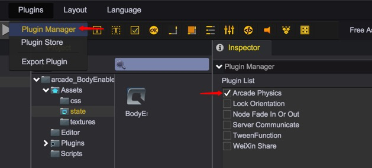
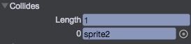

# Arcade物理

青瓷引擎目前使用了Arcade物理系统，并对其进行了一些优化以获得更好的性能。

## 开启物理系统

物理系统目前已经作为一个内置插件集成在了青瓷引擎编辑器中，通过菜单 Plugins->PluginManager 打开插件管理面板，并勾选 Arcade Physics 即可。  


## 刚体

要使一个物体受物理系统的影响，只需要为其添加一个刚体组件(RigidBody)，之后该物体便可受到诸如重力、碰撞、阻力等物理效果的影响。目前仅UIImage和Sprite可以指定为刚体。  
注意：我们对刚体进行了一些限制，在使用刚体时需要注意以下几点，否则物理效果可能无法正常表现：  

* 所有刚体节点及父节点均不能设置旋转
* 所有刚体节点的父节点均不能移动  


### mass
刚体的质量，与 Bounce 属性共同决定了刚体碰撞后的速度变化，质量越大碰撞后的速度变化越小

````javascript
    var rigidbody = self.sprite1.getScript("qc.arcade.RigidBody");

    // 设定刚体质量
    rigidbody1.mass = 100;
````

### moves
是否由物理来决定刚体的位置信息
````javascript
    // 刚体位置由物理决定
    rigidbody.moves = true;
````

### immovable
刚体是否固定不动（即位置不受其他刚体的影响）
````javascript
    // 刚体的位置固定不变
    rigidbody.immovable = true;
````

### collideWorldBounds
碰到游戏世界的边界是否反弹

````javascript
    // 碰到游戏世界的边界后反弹
    rigidbody.collideWorldBounds = true;
````

### allowGravity
是否允许重力，开启后物理将受到重力的影响

### gravity
重力加速度，需要先将 allowGravity 属性设置为true才能生效

````javascript
    // 刚体受重力影响
    rigidbody.allowGravity = true;

    rigidbody.gravity.y = 200;
````

### bounce
反弹力，与 Mass 属性共同决定了两个物体碰撞后的速度变化，反弹力越大物体碰撞后的速度变化越大

````javascript
    // 设定刚体的反弹力
    rigidbody.bounce.x = 0.5;
    rigidbody.bounce.y = 0.5;
````

### vilocity
移动速度

### acceleration
加速度

### drag
空气阻力，当阻力大于0时，在移动的过程中会产生速度衰减

````javascript
    // 设定刚体的移动速度
    rigidbody.vilocity.x = 100;
    rigidbody.vilocity.y = 50;

    // 设定刚体的加速度
    rigidbody.acceleration.x = 10;
    rigidbody.acceleration.y = 5;

    // 设定刚体受到的空气阻力
    rigidbody.drag.x = 5;
    rigidbody.drag.y = 5;
````

### allowRotation
是否允许刚体旋转

### angularVelocity
角速度，需要先将 allowRotation 设置为true才能生效

### angularAcceleration
角加速度

### angularDrag
角阻力，当角阻力大于0时，在旋转的过程中将会产生角速度衰减

````javascript
    // 允许刚体旋转
    rigidbody.allowRotation = true;

    // 设定刚体的角速度
    rigidbody.angularVelocity = 20;

    // 设定刚体的角加速度
    rigidbody.angularAcceleration = 5;

    // 设定刚体受到的角阻力
    rigidbody.angularDrag = 1;
````

### checkCollision
当物体向某个方向移动时，是否检查碰撞，包含上下左右四个方向
````javascript
    rigidbody.checkCollision.up = true;
    rigidbody.checkCollision.down = true;
    rigidbody.checkCollision.left = true;
    rigidbody.checkCollision.right = true;
````

### ccdIterations
碰撞检测时的离散点数量（0或-1表示不检测离散点），用于解决由于移动速度过快而产生的穿透问题。注意：此值越大开销越大，但碰撞检测的效果越好

## 添加碰撞检测的方式
可以通过如下两种方式，指定两个刚体需要进行碰撞：
1. 通过编辑器指定  
  
通过指定collides数组，将其他刚体拖拽进来，表示本刚体将与collides里的所有刚体做碰撞检测
2. 通过代码动态指定  
````
    rigidbody.addCollide(node2);
````

__碰撞时的事件（回调）：__  
在需要关注碰撞结果的刚体节点，挂载逻辑脚本并实现onCollide接口，例如：
````
    var OnCollide = qc.defineBehaviour('qc.demo.OnCollide', qc.Behaviour, function() {
        this.clue = null;
    }, {
        clue: qc.Serializer.NODE
    });

    OnCollide.prototype.onCollide = function(o1, o2) {
        // o1和o2节点发生了碰撞
    };
````

## Video
<video controls="controls" src="../video/plugin_arcade.mp4"></video>

## API
[RigidBody API](http://docs.zuoyouxi.com/api/officialplugins/arcade/RigidBody.html)

## Demo
[Arcade Demos](http://engine.zuoyouxi.com/demo/index.html#anchor_ArcadePhysics)  
