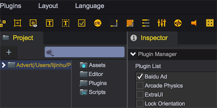
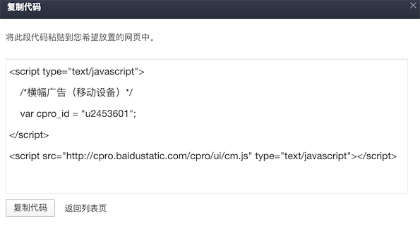
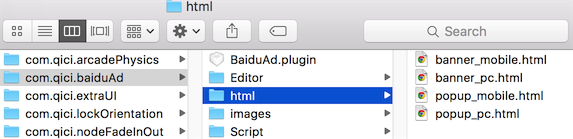
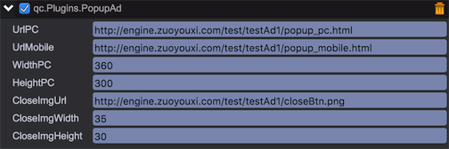

# 百度广告插件

通过在游戏中展示广告，可以适当的增加游戏收入。借助本插件，开发者可以方便的在游戏中展示来自百度联盟的广告，包括两种广告类型：
* 显示在页面顶部/底部的横幅广告（BannerAd）
* 弹出式广告（PopupAd）

## 开启插件
通过菜单 Plugins->PluginManager 打开插件管理面板，并勾选 Baidu Ad 即可开启百度广告插件。
  
 

### 注册百度联盟并获取广告代码
* 注册[百度联盟](http://union.baidu.com)
* [创建代码位](http://yingxiao.baidu.com/support/union/detail_5291.html?castk=159dcda70d2d1ed1dd824)，并获取广告代码。



### 部署广告页面
本插件通过iframe展示广告页面，因此需要制作用于显示广告的页面，并加入上一步骤中获取的广告代码，并将页面部署在web服务器上，广告页面的内容可以在 com.qici.baiduAd/html 目录中获取。



### 插件配置

#### 横幅广告
在需要显示横幅广告的场景中挂接 BannerAd 组件，并进行相应配置


其中，urlPC和urlMobile需要配置为上一步骤中部署好的广告页面地址

使用范例
````javascript
	var bannerAd = self.getScript('qc.Plugins.BannerAd');

	// 显示横幅广告
    self.addListener(self.showBannerBtn.onClick, function() {
        bannerAd.display();
    });

    // 隐藏横幅广告
    self.addListener(self.hideBannerBtn.onClick, function() {
        bannerAd.hide();
    });
	
````

#### 弹出广告
在需要显示弹出广告的场景中挂接 PopupAd 组件，并进行相应配置



其中，urlPC和urlMobile需要配置为上一步骤中部署好的广告页面地址

使用范例
````javascript
	var popupAd = self.getScript('qc.Plugins.PopupAd');

	// 注册点击弹出广告事件
    self.addListener(popupAd.onAccessAd, function() {
        alert('Access Advert');
    });

    // 显示弹出式广告
    self.addListener(self.showPopupBtn.onClick, function() {
        popupAd.display();
    });

    // 隐藏弹出式广告
    self.addListener(self.hidePopupBtn.onClick, function() {
        popupAd.hide();
    });
	
````

## API
[BannerAd](http://docs.zuoyouxi.com/api/officialplugins/baiduAd/BannerAd.html)
[PopupAd](http://docs.zuoyouxi.com/api/officialplugins/baiduAd/PopupAd.html)

## Demo
[BaiduAd Demo](http://engine.zuoyouxi.com/demo/Plugin/Advert/index.html)