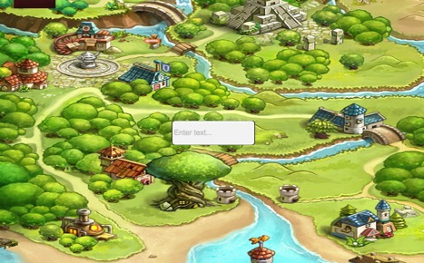
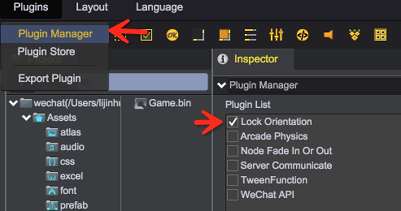

# 锁屏

当设备旋转并发生横竖屏切换时，游戏中获取到的分辨率值会发生变化。同时，由于界面会根据分辨率进行自适应调整，因此旋转后整个界面会重新排版。

原始界面效果（竖版）  

设备旋转90度后效果（未开启锁屏）  

在某些情况下，当设备旋转时，我们希望界面的排版保持不变，此时就需要借助锁屏插件来实现。

## 开启插件
锁屏功能目前已经作为一个内置插件集成在了青瓷引擎编辑器中，通过菜单 Plugins->PluginManager 打开插件管理面板，并勾选 Lock Orientation 即可。
 

## LockOrientation
在需要保持横/竖屏的场景节点（非 UIRoot 节点）上挂接LockOrientation组件，并指定游戏是横屏还是竖屏。之后当设备发生横竖屏切换时，场景的根节点就会进行相应旋转，以使界面保持原先的排版效果。   

### Orientation
当前限定为横版还是竖版

### Desktop
在PC上是否启用（若勾选，则可在预览页面中模拟设备旋转，并预览旋转后的界面效果）

设备旋转90度后效果（开启锁屏）    
 

## Demo
[LockOrientation Demo](http://engine.zuoyouxi.com/demo/Plugin/lock_orientation/index.html)