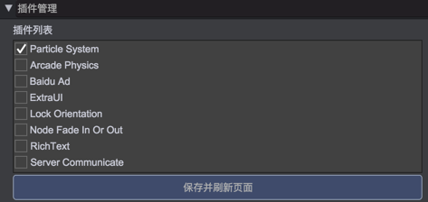
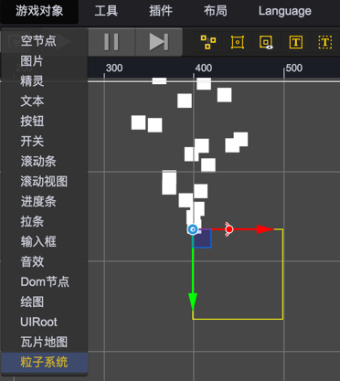
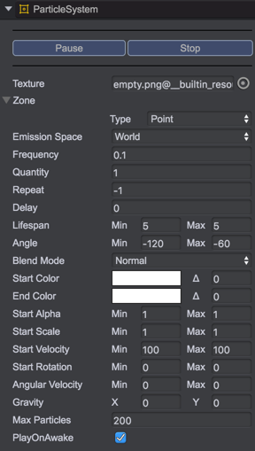
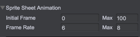
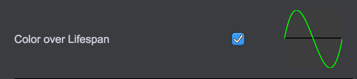
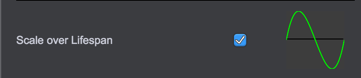
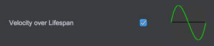

# 粒子系统

青瓷引擎中的粒子系统可以用来制作烟雾、火焰、爆炸和各种大气效果（如雨雪等），借助粒子系统，通过少量的图片资源就可以模拟出上述各种复杂效果。

# 开启插件

粒子系统目前以内置插件的形式提供，需要通过菜单 插件->插件管理 打开插件管理面板，并勾选 Particle System 选项。  
   

# 创建粒子系统

开启粒子系统插件后，通过菜单 游戏对象->粒子系统 即可在场景中添加一个粒子系统物体。  
   

# 粒子系统查看面板
选中场景中的粒子系统物体，即可通过属性查看面板对粒子系统的各种属性进行设置和预览。  
    

## Texture
粒子使用的图片，支持以下三种形式：
* 图集中的某一张图片，此时所有粒子都将使用该图片。
* 整个图集，此时粒子将随机使用图集中的任一张图片。
* 设置了 SpriteSheet 信息的普通贴图，此时粒子将根据 SpriteSheet 配置选择相应的序列帧图片，并播放相应的帧动画。

## Zone
发射区域，支持点、线段、圆、矩形四种区域类型，发射区域决定了粒子的初始位置。

## EdgeEmission
是否从发射区域的边缘发射粒子。

## EmissionSpace
发射空间，支持设置为World或者Local。
* 当设置为 World 时，发射出去的粒子将不再受粒子系统节点的影响。
* 当设置为 Local 时，发射出去的粒子将跟随粒子系统节点一起移动。

## Frequency
发射频率，即多久发射一次粒子，以秒为单位。

## Quantity
每次发射的粒子数量。

## Repeat
重复发射次数，若设置为-1则表示循环发射。

## Delay
发射延迟，以秒为单位。

## Lifespan
每个粒子的生命时长，在指定范围内随机取值，以秒为单位。

## Angle
粒子的发射角度，在指定范围内随机取值，用来控制粒子的发射方向。

## BlendMode
粒子的混合模式，对应于 Phaser.blendModes。

## StartColor
粒子初始颜色，即粒子刚发射时的颜色。

## StartColorVariation
粒子初始颜色浮动。

## EndColor
粒子目标颜色，即粒子生命结束时的颜色。

## EndColorVariation
粒子目标颜色浮动。

## StartAlpha
粒子初始透明度，在指定范围内随机取值。

## StartScale
粒子初始缩放，在指定范围内随机取值。

## StartRotation
粒子初始旋转，在指定范围内随机取值。

## StartVelocity
粒子初始速度，在指定范围内随机取值。

## AngularVelocity
粒子初始角速度，在指定范围内随机取值。

## Gravity
粒子系统重力，通过设置重力的水平和垂直分量值，可以实现粒子向某个方向加速运动。

## MaxParticles
最大粒子数量，当粒子数量超过此值时将暂停发射。

## PlayOnAwake
粒子系统激活时是否自动开始发射，若设置为false，需要手动调用相关接口进行发射（具体请参考[API文档](http://docs.zuoyouxi.com/api/officialplugins/particleSystem/CParticleSystem.html))

# 粒子帧动画控制模块   
     
通过此模块，可以设置粒子帧动画相关信息，包括：
* 粒子帧动画的初始帧
* 粒子帧动画速率  
注：仅当 Texture 为 SpriteSheet 类型时，此模块才会生效。

# 粒子颜色控制模块   
    
开启此模块后，可以通过曲线控制粒子在生命周期内的颜色变化。若将此模块关闭，粒子颜色将在 startColor 和 endColor 之间线性变化。

# 粒子透明度控制模块  
   
开启此模块后，可以通过曲线控制粒子在生命周期内的透明度变化。  
注：若粒子的透明度保持不变，应该将此模块关闭，以减少粒子系统的性能开销。

# 粒子缩放控制模块  
   
开启此模块后，可以通过曲线控制粒子在生命周期内的缩放变化。  
注：若粒子的缩放保持不变，应该将此模块关闭，以减少粒子系统的性能开销。

# 粒子速度控制模块  
   
开启此模块后，可以通过曲线控制粒子在生命周期内的速度变化。  
注：若粒子的速度保持不变，应该将此模块关闭，以减少粒子系统的性能开销。

# 粒子角速度控制模块  
   
开启此模块后，可以控制粒子在生命周期内的角速度变化。  
注：若粒子的角速度保持不变，应该将此模块关闭，以减少粒子系统的性能开销。

## API
[ParticleSystem API](http://docs.zuoyouxi.com/api/officialplugins/particleSystem/CParticleSystem.html)

## Demo
[ParticleSystem Demos](http://engine.zuoyouxi.com/demo/index.html#anchor_ParticleSystem)  