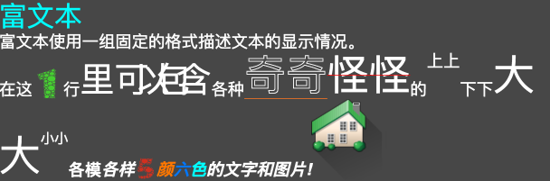
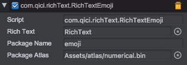
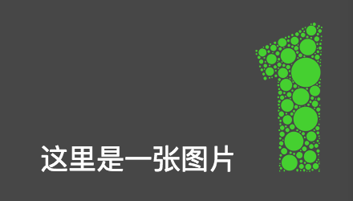

# 富文本插件
## 描述
在游戏中显示大量文本时，有时候需要不同颜色，不同形式的文本混合使用。这时候使用UIText组件已经不能满足需求，那么可以使用富文本组件来实现需要的效果。如图：


## 富文本结构
### 注册图集
如果需要在富文本中使用图片，需要先使用RichTextEmoji像富文本中注册图集。  
如图所示：

* 设置Package Name 为注册的package名称
* 设置Package Atlas 为需要导入的图集
* 设置Rich Text 为导入到的富文本显示区域

### 结构定义
* 使用[符号]文本[/符号]
	这里，符号代表的显示风格作用于自己内部的文本或者结构上
	例如：
	````
	[b]这段文本将被加粗[/b]
	````


* 使用[符号/]
	这里，符号的风格没有实际作用对象，自己可以生成一个显示单元来显示。
	例如：
	````
	这里是一张图片[image package=emoji frame=1.png/]
	````


### 符号的属性定义
使用 [符号 属性1=值1 属性2=值2]文本[/符号]的形式类定义符号的属性。例如
````
[underline color=#ff0000]这个文本将被画上红色的下滑线[/underline]
````


### 已经支持的属性
| 标记             | 描述                                    | 例子                                                        |
| -----          | -----                                 | -----                                                     |
| color          | 文本颜色                                  | [color=#ffff00]文本[/color][color=rgb(255,255,0)]文本[/color] |
| size           | 文本大小                                  | [size=12]文本[/size]                                        |
| text-align     | 行文本的对齐方式，可选值有start，end，center，justify | [text-align=start]文本[/text-align]                         |
| vertical-align | 文本在行内的对齐方式，可选值top，middle，bottom       | [vertical-align=top]文本[/vertical-align]                   |
| b              | 粗体                                    | [b]文本[/b]                                                 |
| i              | 斜体                                    | [i]文本[/i]                                                 |
| linespace      | 文本的行间距                                | [lineSpace=10]文本[/lineSpace]                              |
| charspace      | 字间距                                   | [charspace=2]文本[/charspace]                               |
| lineweight     | 行水平显示时为行高，竖直显示时为行宽                    | [lineweight=33]文本[/lineweight]                            |
| underline      | 下划线                                   | [underline]文本[/underline][underline color=#ff0000]文本[/underline]                                 |
| strikethrough  | 删除线                                   | [strikethrough]文本[/strikethrough] [strikethrough color=#ff7700]文本[/strikethrough]                        |
| stroke         | 中空绘制                                  | [stroke]文本[/stroke]                                       |
| click          | 点击处理，点击时调用RichText对象上挂载脚本的对应方法        | [click='onMyClick']文本[/click]                             |
| image          | 图片显示，需要使用RichTextEmoji载入需要使用的图集       | [image package='emoji' frame='1.png'/]                    |

例如下面段文本：
````
[size=40][color=#00ffff]富文本[/size]
[size=24]富文本使用一组固定的格式描述文本的显示情况。[/size]
[size=24]在这[image package=emoji frame="1.png" width=45 height=45/]行[size=50]里可[charspace=-20]以包含[/size]各种[size=60][stroke][underline color=#ff7722]奇奇[/stroke][strikethrough color=#ff0000]怪怪[/size]的[vertical-align=top]上上[/vertical-align][vertical-align=bottom]下下[/vertical-align][size=60]大大[/size][size=20][vertical-align=middle]小小[/size][b]各模[b][i]各样[i][color=#ff0000][image package=emoji frame="5.png" width=32 height=32/][/color][color=#ff7700]颜[/color][color=#0077ff]六[/color][color=#00ffff]色[/color]的文字和图片![image package=city frame="level5.png"/][/size]
[size=32][color=#00ffff]格式说明[/size]
[size=24]
1. 标记使用 [b][i][aaaa][标记]内容[/标记][/aaaa][/i][/b] 或者 [b][i][aaaa][标记/][/aaaa][/i][/b] 表示标记的有效范围。
2. 如果标记不在支持的范围，则直接文本显示其包含的所有内容。
	例如：[bbbb][aaaa][d]aa[/d][/aaaa][/bbbb] 最终显示文本为[aaaa][d]aa[/d][/aaaa]
[/size]
[size=32][color=#00ffff]已经支持的标记[/size]
[size=23][b][i][color=#ff7700]color[/i][/b]		文本颜色 效果:[color=#00ffff]文本[/color][color=rgb(255,255,0)]文本[/color]
[b][i][color=#ff7700]size[/i][/b]		文本大小 效果:[size=12][color=#00ffff]文本[/size]
[b][i][color=#ff7700]text-align[/i][/b]		行文本的对齐方式，可选值有start，end，center，justify 效果:
[text-align=start][color=#00ffff]文本[/text-align]
[text-align=center][color=#00ffff]文本[/text-align]
[text-align=end][color=#00ffff]文本[/text-align]
[text-align=justify][color=#00ffff]文本[/text-align]
[b][i][color=#ff7700]vertical-align[/i][/b]		文本在行内的对齐方式，可选值top，middle，bottom 效果:
[size=40]文本[size=12][color=#00ffff][vertical-align=top]文本[/vertical-align][vertical-align=middle]文本[/vertical-align][vertical-align=bottom]文本[/vertical-align][/size][/size]
[b][i][color=#ff7700]b[/i][/b]		粗体  效果:[b][color=#00ffff]文本[/b]
[b][i][color=#ff7700]i[/i][/b]		斜体 效果:[i][color=#00ffff]文本[/i]
[b][i][color=#ff7700]linespace[/i][/b]		文本的行间距 效果:[lineSpace=50][color=#00ffff]文本[/lineSpace]
[b][i][color=#ff7700]charspace[/i][/b]		字间距 效果:[charspace=10][color=#00ffff]文本[/charspace]
[b][i][color=#ff7700]lineweight[/i][/b]		行水平显示时为行高，竖直显示时为行宽 效果:[lineweight=33][color=#00ffff]文本[/lineweight]
[b][i][color=#ff7700]underline[/i][/b]		下划线 效果:[underline][color=#00ffff]文本[/underline]
[b][i][color=#ff7700]strikethrough[/i][/b]		删除线 效果:[strikethrough color=#ffff00][color=#00ffff]文本[/strikethrough]
[b][i][color=#ff7700]stroke[/i][/b]		中空绘制 效果:[stroke][size=50][color=#00ffff]文本[/stroke]
[b][i][color=#ff7700]click[/i][/b]	点击处理，点击时调用RichText对象上挂载脚本的对应方法 效果:[click='onMyClick'][underline color=#ff0000][color=#00ffff]文本[/underline][/click] 
[b][i][color=#ff7700]image[/i][/b] 图片 [size=50]效果 [image package=emoji frame="1.png" width=100 height=100/]图片显示[/size]
[/size]
````


## 富文本标记拓展
如果上面已经提供的标记不能满足实际需求，或者希望简化标记，那么就需要拓展标记。
### 符号管理
每个富文本块都有自己的一个symbol管理器，可以通过RichText.symbol来获取。
通过

* __ symbol.registerSymbol(key, attributeToStyleFunction) __ 注册风格符号  
* __ symbol.registerDrawStyle(key, drawFunction) __ 注册绘制方式  
* __ symbol.registerEmoji(key, emoji) __ 注册图集  
来拓展符号

### 利用现有标记
如果只是想整合现有标记的作用或者进行简化，可以通过registerSymbol来自定义标记。
例如：整合加粗，斜体，字体功能，定义一个标题的标记h1。实现如下:
````javascript
	richText.symbol.registerSymbol('h1', function(key, attribute, currStyle) {
		return {
			fontStyle: 'italic',
			fontWeight: 'bold',
			fontSize: '30px'
		};
	});
````
使用时:
````
[h1]这个是标题[/h1]
这个是正文 
````


### 自定义效果
如果当前的已提供的标记无法满足条件，则需要自己拓展绘制。
可以在registerSymbol的返回风格中设置：
* onEnable(section) - 当风格生效时的调用，可一个返回一个自己生成的RichTextChunk数组，来添加显示效果
* onDisable(section) - 当风格失效时的调用，可一个返回一个自己生成的RichTextChunk数组，来添加显示效果
* preDrawHandle(context, style, block, elementIdx, x, y) - 绘制之前的调用
* preDrawBlockHandle(context, block, elementIdx, x, y) - 绘制元素前调用
* drawElementHandle(context, block, elementIdx, x, y) - 绘制元素
* postDrawElementHandle(context, block, elementIdx, x, y) - 绘制元素完成后调用
* postDrawHandle(context, block, elementIdx, x, y) - 绘制之后的调用
* onClickHandle(context, block, elementIdx, x, y) - 点击事件处理
* measureHandle(context, style, body) - 计算块的显示属性
例如实现带描边的标签：
````
	// 描边标签
    richText.symbol.registerSymbol('s', function(key, attribute, currStyle) {
        // 获取描边属性
        var size = attribute.size == null ? 1 : parseInt(attribute.size);
        var style = {
            strokeSize : size,
            preDrawHandle : function(context, block, elementIdx, x, y) {
				context.font = block.style.getFont();
                context.textBaseline = 'middle';
                var rect = block.elementRects[elementIdx].rect;
                // 绘制描边
                var oldLineWidth = context.lineWidth;
                context.lineCap = 'round';
                context.lineJoin = 'round';
                context.lineWidth = block.style.strokeSize;
                if (block.style.strokeColor)
                    context.strokeStyle = block.style.strokeColor;
                else
                    context.strokeStyle = block.style.fontColor;

                context.strokeText(block.elements[elementIdx], x + rect.x, y + rect.y + rect.height / 2);
                context.lineWidth = oldLineWidth;
                // 绘制文本
                //context.fillText(block.elements[elementIdx], x + rect.x, y + rect.y + rect.height / 2);
            }
        };
        if (attribute.color) {
            style.strokeColor = attribute.color;
        }
        return style;
    });
````
使用时:
````
这个是正文 
 [s size=10 color=#ff7700]这个是描边文本[/s]
这个是正文 
````


__* 更多使用方式参考API组合实现 *__

## API
[RichText API](http://docs.zuoyouxi.com/api/officialplugins/RichText/index.html)

## Demo
[Wechat Demo](http://engine.zuoyouxi.com/demo/Plugin/RichText/index.html)