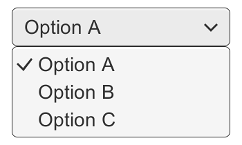
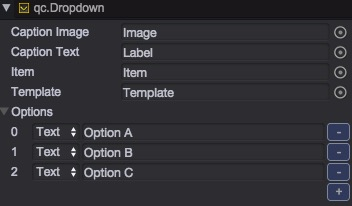

# 下拉框

下拉框(qc.Dropdown)组件允许用户从列表中选择一个选项。  

该组件显示当前被选中的选项。一旦选项被点击，所有可以选择的选项列表将被呈现出来，一旦选项被选中列表将自动关闭。当然，你可以通过点击屏幕的其他任何位置来关闭选择列表页面。  

    
  下拉框    

    
  带列表的下拉框    

## Inspector面板说明

* **Caption Image**: 当选项是图片时，显示选中图片的Image组件
* **Caption Text**: 当选项是文本时，显示选中文本的Text组件
* **Item**: 用来显示下拉框选项，有N个选项就会被复制多个
* **Template**: 用来显示下拉框的模板
* **Options**: 所有的选项列表。可以指定为文本或者图片

## 细节说明
列表的选项可以在Inspector面板中指定，也可以通过代码来动态添加。对于每个选项，可以指定一个文本字符串，也可以指定为一张图片。当列表的选项发生变化时，将会派发onValueChanged事件，并指明了哪个选项被选择了。0表示第一个选项，1表示第二个选项，依次类推。  
### 模板(Templete)
Dropdown组件有一个子节点（名称为templete），这个子节点将作为下列列表框的模板来显示。默认情况下，此节点处于隐藏状态，你可以在编辑时设置其可见，以方便界面设计。在Dropdown组件中，属性templete指向了本节点。  

template节点中，必须有个item。当下拉列表显示时，此item将被多次复制以显示具体的列表选项信息。  

template的显示没有强制的要求，可以自由定制。默认情况下，提供了一个滚动窗口以容纳所有的选项。需要注意的是：这并不是强制要求。  

### 下拉列表的位置
下拉列表的位置相对于与下拉框进行定位。默认情况下，列表处于下拉框的下方。当下拉框显示范围超过屏幕时，系统会自动将下拉列表显示在控件的上方（这就有个限制：下拉列表框的高度 < 游戏世界高度/2）。  

## API
[Dropdown API](http://docs.zuoyouxi.com/api/gameobject/CDropdown.html)

## Demo
[Dropdown Demo](http://engine.zuoyouxi.com/demo/#anchor_Dropdown)
