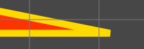

# 几何图形绘制
qc.Graphics用来绘制一些简单的几何图形，例如：线条、矩形等。本组件需要和逻辑脚本配合，通过调用相关的绘制接口实现几何图形的绘制。

*__注意__:*
在绘制几何图形时，对应转角的处理，会由于context.lineJoin和context.miterLimit的不同，产生不同的效果。如下图所示：  
|||
所以当本组件和脏矩形配合使用时，在显示更新时会有缺失或者遗漏，此时可以通过设置属性 __boundsPadding__ 来拓展图形边界，来正常更新显示内容。

## 接口功能一览
* __drawTriangle__
  绘制一个三角形
* __drawTriangles__
  绘制多个三角形
* __lineStyle__
  设置线条样式
* __moveTo__
  移动到目标位置
* __lineTo__
  从当前节点绘制一条线到目标位置
* __arcTo__
  绘制弧线连接两点
* __beginFill__
  开始填充颜色
* __endFill__
  结束填充颜色
* __clear__
  清除画布
* __drawRect__
  绘制矩形
* __drawCircle__
  绘制圆
* __drawEllipse__
  绘制椭圆形
* __drawPolygon__
  绘制多边形
* __quadraticCurveTo__
  绘制 quadratic bezier 曲线
* __bezierCurveTo__
  绘制 bezier 曲线

## 视频演示

<video controls="controls" src="../video/oper_graphics.mp4"></video>

## Demo
[Graphics Demo](http://engine.zuoyouxi.com/demo/Graphics/draw-line/index.html)
