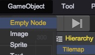
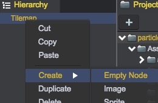
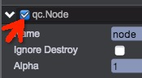
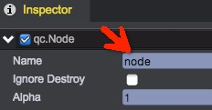
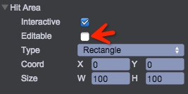

# 空节点
空的游戏对象qc.Node。所有游戏中的对象（例如UIImage、Sprite、Text）都继承于Node。因此对Node的操作，也适用于其他所有的界面组件。  
Node节点本身不具备渲染功能，更多的只是用于场景树的组织、功能脚本的挂载。

## 创建一个Node节点
有4种方式可以创建一个空的Node节点：
### 1. 使用主菜单：  
  
### 2. 工具栏：  
  
### 3. 右键菜单：  
  
### 4. 使用代码动态创建：  
````javascript
// 创建一个空的Node节点，指定其父亲为parent
game.add.node(parent);
````

## Node节点在编辑器中的操作
  

### 可见 
勾选节点名称前的单选框按钮，如果节点不可见，Hierarchy中会灰色显示。  
  
````javascript
node.visible = true;
````

### 名称  
节点的名称不要有符号：'/'，因为此符号在场景节点查找中会作为分隔符来显示，具体请参看API。支持中文名称  
  
````javascript
node.name = '青瓷引擎';
````  

### Ignore Destroy  
该属性仅在游戏对象为world的直接孩子节点才起作用。如果Ignore Destroy被勾选上，那么此节点（及所有子孙）在场景切换中不会被析构，在整个游戏生命周期中将永远存在。参见[场景加载界面](../LoadingPrefab/index.html)  
需要注意的是，节点必须是根节点才起效。    
````javascript
node.ignoreDestroy = true;
````

### 透明度  
节点Alpha透明度，有效值为0.0~1.0，0.0完全透明，1.0完全不透明，子节点的透明度会受到父亲节点的影响。 
````javascript 
node.alpha = 0.5; 
````

### Transform  
参见[布局基础](../UI/BasicLayout.html)  

### Hit Area  
当Interactive（是否可交互）未勾选上时，此节点不具备接收鼠标事件或触摸事件的能力，事件将会穿透到底下的节点。如果勾选上，那么Input事件将在此节点捕获。
````javascript 
node.interactive = true;
```` 

默认情况下，交互区域与对象矩形区域重合，可点击Editable进行可视化编辑：   
   
  
* None：相当于不可交互，node.hitArea = null;
* Fit Target：默认值，保持与对象矩形区域重合，node.hitArea = undefined;
* Rectangle：矩形交互区域，node.hitArea = new qc.Rectangle(x, y, width, height);
* Ellipse：椭圆交互区域，node.hitArea = new qc.Ellipse(x, y, width, height);    

视频演示：  
<video controls="controls" src="../video/oper_node.mp4"></video> 

### 添加脚本  
点击"Add Component"按钮可以添加逻辑脚本，节点通过挂载逻辑脚本真正发挥作用。

<video controls="controls" src="../video/add_script_to_node.mp4"></video>  

## Node常用的API列表
[Node API](http://docs.zuoyouxi.com/api/gameobject/CNode.html)
