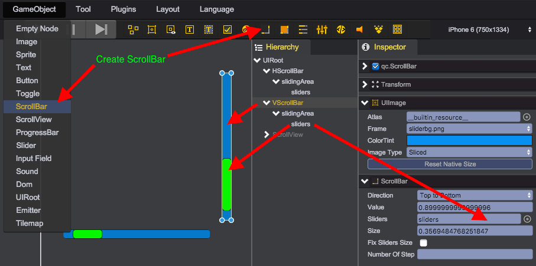

# 滚动条
滚动条组件(qc.ScrollBar)类似[拉条组件Slider](Slider.html)，支持用户通过拖拽选择滚动位置，一般结合[滚动视图ScrollView](#scrollview)使用。

## ScrollBar构成
从主菜单(游戏对象/滚动条)或工具条上创建两个滚动条对象，一个水平摆放，一个竖直摆放，得到如下对象结构：

* __ScrollBar__ - qc.ScrollBar对象，继承于[UIImage](UIImage.html)类型，作为背景图片
* __slidingArea__- qc.Node对象，作为滚动条的显示区域，默认其完全填充满父节点ScrollBar的矩形区域
* __sliders__ - qc.UIImage对象，作为前景图片滑块对象，设置到ScrollBar.sliders属性上

通过如下代码可实现与以上操作同样的效果：
````javascript
// 创建滚动条对象
var scrollBar = new qc.ScrollBar(game, parent);

scrollBar.width = 160;
scrollBar.height = 20;
scrollBar.size = 0.2;
scrollBar.direction = qc.ScrollBar.LEFT_TO_RIGHT;

// 创建滚动区域对象
var slidingArea = game.add.node(scrollBar);
slidingArea.name = 'slidingArea';
slidingArea.setAnchor(new qc.Point(0, 0), new qc.Point(1, 1));
slidingArea.setStretch(0, 0, 0, 0);
slidingArea.pivotX = slidingArea.pivotY = 0.5;

// 创建滑块对象
var sliders = game.add.image(slidingArea);
sliders.name = 'sliders';
sliders.setAnchor(new qc.Point(0, 0), new qc.Point(1, 1));
sliders.setStretch(0, 0, 0, 0);
sliders.pivotX = sliders.pivotY = 0.5;
scrollBar.sliders = sliders;
scrollBar.interactive = true;

scrollBar.texture = game.assets.find('__builtin_resource__');
scrollBar.frame = 'sliderbg.png';
scrollBar.imageType = qc.UIImage.IMAGE_TYPE_SLICED;

sliders.texture = game.assets.find('__builtin_resource__');
sliders.frame = 'button.png';
sliders.imageType = qc.UIImage.IMAGE_TYPE_SLICED;
````

## ScrollBar属性

* __Direction__: 滚动条方向，支持如下四种类型，node.direction = qc.ScrollBar.LEFT_TO_RIGHT;
 * qc.ScrollBar.LEFT_TO_RIGHT，水平方向滚动，左端为0，右端为1
 * qc.ScrollBar.RIGHT_TO_LEFT，水平方向滚动，左端为1，右端为0
 * qc.ScrollBar.TOP_TO_BOTTOM，竖直方向滚动，顶端为0，底端为1
 * qc.ScrollBar.BOTTOM_TO_TOP，竖直方向滚动，顶端为1，底端为0
* __Value__: 当前滚动条位置值，取值范围0.0~1.0
* __Sliders__: 绑定滑块对象，scrollBar.sliders = sliders;
* __Size__: 滑块大小，取值范围0.0~1.0，scrollBar.size = 0.2;
* __Fix Silders Size__: 是否指定滑块大小，scrollBar.fixSlidersSize = true;
* __Number Of Step__: 滚动时滑块从0到1的步数，scrollBar.numberOfStep = 10;

# 滚动视图
滚动视图(qc.ScrollView)用于当所要显示的内容需要占用比较大的空间，却需要在一个较小的区域显示，滚动视图提供滚动内容功能。

## ScrollView构成
从主菜单(游戏对象/滚动视图)或工具条上创建滚动视图对象，并创建一个UIImage对象作为大图片内容，得到如下的滚动视图对象结构：

* __ScrollView__ - qc.ScrollView对象，继承于[UIImage](UIImage.html)类型，本例中设置内置的button2.png图片作为灰色底图
* __node__ - qc.Node对象，被scrollView.content所引用，作为需要滚动显示内容的根节点
* __background__ - qc.UIImage对象，图片尺寸大于scrollView对象矩形区域

通过如下代码可实现与以上操作同样的效果：
````javascript
// 创建滚动视图对象
var scrollView = new qc.ScrollView(game, parent);

// 设置灰色底图
scrollView.texture = game.assets.find('__builtin_resource__');
scrollView.frame = 'button.png';
scrollView.imageType = qc.UIImage.IMAGE_TYPE_SLICED;

// 设置滚动视图大小
scrollView.width = 400;
scrollView.height = 400;

// 运行水平和垂直滚动
scrollView.canHorizontal = true;
scrollView.canVertical = true;

// 开启交互功能
scrollView.interactive = true;
// 滚动区域有限制，但可以超越边界，之后被反弹回来
scrollView.movementType = qc.ScrollView.MOVEMENT_ELASTIC;
// 超出边界后反弹复位速度，elasticity值越大，复位越慢
scrollView.elasticity = 2;

// 设置mask进行内容裁切
var mask = scrollView.addScript("qc.NodeMask");
mask.checkInField = false;

// 创建滚动内容
var content = game.add.node(scrollView);
scrollView.content = content;

// 设置滚动背景图片内容
var background = game.add.image(content);
background.texture = game.assets.find('backgroundKey');
background.resetNativeSize();

````

## ScrollView属性

* __Content__: 滚动视图内容，node.content = content。滚动视图将自动计算本节点及其所有可视的一级孩子节点的包围盒，并将其作为滚动内容的大小。所以可以设置content宽高来控制滚动窗口的最小尺寸。
* __Horizontal Scroll:__ 水平滚动
	* Horizontal: 是否允许水平滚动，node.canHorizontal = true;
	* ScrollBarH: 绑定水平滚动条对象，node.horizontalScrollBar = scrollBar;
	* Value: 水平方向滚动比例，node.horizontalNormalizedPosition = 0.5;
* __Vertical Scroll__: 垂直滚动
	* Vertical: 是否允许垂直滚动，node.canVertical = true;
	* ScrollBarV: 绑定垂直滚动条对象，node.verticalScrollBar = scrollBar;
	* Value: 垂直方向滚动比例，node.verticalNormalizedPosition = 0.5;
* __Movement Type__: 移动类型，目前支持以下三种类型，node.movementType = qc.ScrollView.MOVEMENT_ELASTIC;
	* qc.ScrollView.MOVEMENT_UNRESTRICTED: 滚动区域无限制
	* qc.ScrollView.MOVEMENT_ELASTIC: 滚动区域有限制，但可以超越边界，之后被拖回
	* qc.ScrollView.MOVEMENT_CLAMPED: 滚动区域有限制，无法超过边界
* __Elasticity__: 超出边界后反弹复位速度，值越大，复位越慢，node.elasticity = 2；
* __Inertia__: 是否惯性滑动，node.inertia = true;
* __DecelerationRate__: 惯性滑动的减速参数，node.decelerationRate = 0.03;
* __ScrollSensitivity__: 响应滚动时的倍率，node.scrollSensitivity = 1;
* __Propagation Scroll__: 滚动到边界时是否向父亲传播滚动事件，仅支持movementType为MOVEMENT_CLAMPED类型

## Video
<video controls="controls" src="../video/oper_scrollview.mp4"></video>  

## API
* [ScrollBar API](http://docs.zuoyouxi.com/api/gameobject/CScrollBar.html)
* [ScrollView API](http://docs.zuoyouxi.com/api/gameobject/CScrollView.html)

## Demo
[Demo](http://engine.zuoyouxi.com/demo/ScrollView/scrollView_with_scrollbar/index.html)
