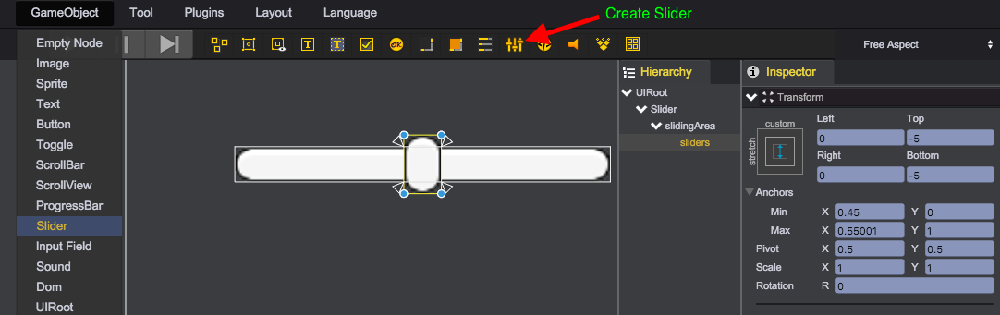
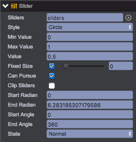

# 拉条

拉条(qc.Slider)组件允许用户通过拖拽方式选择指定范围内的数值，继承于[ProgressBar](ProgressBar.html)类，因此具有所有ProgressBar的显示效果。  


## Inspector面板说明


* __Sliders__: UIImage类型滑块对象，node.sliders = sliders;
* __Style__: 目前支持三种拉条风格，node.style = Slider.STYLE_HORIZONTAL;
	* 水平拉条 - Slider.STYLE_HORIZONTAL
	* 竖直拉条 - Slider.STYLE_VERTICAL
	* 圆形拉条 - Slider.STYLE_CIRCLE
* __Min Value__: 拉条最小值，node.minValue = 0.0;
* __Max Value__: 拉条最大值，node.maxValue = 1.0;
* __Value__: 当前拉条值，node.value = 0.3;
* __Fixed Size__: 滑块所占父亲节点矩形区域百分比，1.0为整个区域，小于0.0表示不固定大小，node.fixedSize = 0.3;
* __Can Pursue__: 勾选此选项时，拉条滑块位置会自动追逐到点击处 node.canPursue = true;
* __Clip Sliders__: 是否对拉条滑块进行裁切，一般为圆形拉条时勾选，node.clipSliders = true;
* __Start Radian__: 圆形拉条时起效，表示起始弧度，node.startRadian = Math.PI;
* __End Radian__: 圆形拉条时起效，表示结束弧度，node.endRadian = Math.PI;
* __Start Angle__: 圆形拉条时起效，表示起始角度，node.startAngle = 90;
* __End Angle__：圆形拉条时起效，表示结束角度，node.endAngle = 90;
* __State__: 拉条状态属性state，具有以下几种状态：
	* qc.UIState.NORMAL - 正常状态
	* qc.UIState.PRESSED - 按下状态
	* qc.UIState.DISABLED - 不可用状态

以下演示如果通过代码动态创建拉条（便于理解而已，实际应用中请在编辑器中直接创建）  
````javascript
var slider = new qc.Slider(game, parent);

slider.interactive = true;
slider.width = 160;
slider.height = 20;

var slidingArea = game.add.node(slider);
slidingArea.name = 'slidingArea';
slidingArea.setAnchor(new qc.Point(0, 0), new qc.Point(1, 1));
slidingArea.setStretch(0, 0, 0, 0);
slidingArea.pivotX = slidingArea.pivotY = 0.5;

var sliders = game.add.image(slidingArea);
sliders.name = 'sliders';
sliders.setAnchor(new qc.Point(0.5, 0.5), new qc.Point(0.5, 0.5));
sliders.setStretch(0, 0, 0, 0);
sliders.pivotX = sliders.pivotY = 0.5;

slider.sliders = sliders;

slider.texture = game.assets.find('__builtin_resource__');
slider.frame = 'button.png';
slider.imageType = qc.UIImage.IMAGE_TYPE_SLICED;
slider.height = 15;
slider.value = 0.5;

sliders.texture = game.assets.find('__builtin_resource__');
sliders.frame = 'button.png';
sliders.imageType = qc.UIImage.IMAGE_TYPE_SLICED;
sliders.height = 15;

````

## API
[Slider API](http://docs.zuoyouxi.com/api/gameobject/CSlider.html)

## Demo
[Slider Demo](http://engine.zuoyouxi.com/demo/Slider/slider_mixed/index.html)
