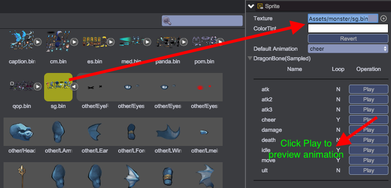

# 精灵
精灵qc.Sprite具有和[UIImage](UIImage.html)类似的显示图片功能，但精灵更多用于播放图片动画帧，和播放骨骼动画效果。

__注意：精灵对象不允许挂载孩子节点__

## 动画类型
精灵对象的animationType属性决定了动画类型，该属性不需要用户指定，在设置texture资源属性时，内部会根据资源类型自动设置animationType属性，目前支持以下四种类型：
* __普通图片__ - qc.Sprite.NONE_ANIMATION
* __图片帧动画__ - qc.Sprite.FRAME_ANIMATION
* __骨骼动画__ - qc.Sprite.DRAGON_BONES
* __骨骼采样动画__ - qc.Sprite.FRAME_SAMPLES

### 普通图片
无动画，用于显示普通图片  

````javascript
// 设置图片资源
node.texture = game.assets.find('textureKey');
````

### 图片帧动画
按一定的频率切换图片帧达到动画效果  

````javascript
// 设置图片资源
node.texture = game.assets.find('textureKey');
// 设置默认动画
node.defaultAnimation = 'test1';
// 播放指定动画
node.playAnimation('test2');
// 停止播放动画
node.stop();
````

参见[编辑帧动画](../FrameAnimation/index.html)  


### 骨骼动画
制作骨骼动画参见[骨骼动画](../DragonBone/index.html)  

骨骼动画制作成本较高，但图片资源内存占用小于帧动画，骨骼动画的所有API接口和图片帧动画完全一致。

### 骨骼采样动画
骨骼采样动画类型使用方式和骨骼动画类型完全一致，不同在于导入骨骼动画资源后需要进行采样格式转换，采样后骨骼动画的运行效率会明显提高，但占用内存会稍微增大，如无特殊要求建议使用采样的骨骼动画方式。  


## Sprite 常用的API列表
[Sprite API](http://docs.zuoyouxi.com/api/gameobject/CSprite.html)

## Sprite 相关 Demo
[Sprite Demo](http://engine.zuoyouxi.com/demo/index.html#anchor_Sprite)
