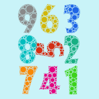
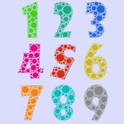

# 表格布局
qc.TableLayout可以挂载在任意节点上，将该节点下的所有可见节点，按一定的宽高进行排布。
在进行布局时，首先根据子节点的数量、大小等信息，计算出表格的列数、行数、单元格的大小，然后将子节点根据设置调整到单元格中进行显示。

````javascript
var tableLayout = node.addScript('qc.TableLayout');
````

## 尺寸提供方式(SizeProvider)

进行布局计算时，需要获取或者设置子节点的尺寸，这个尺寸可以通过单元格尺寸(Cell Size的x和y)来设置。
````javascript
tableLayout.cellWidth = 200;
tableLayout.cellHeight = 160;
````

如果单元格尺寸cellWidth或cellHeight为0，则取子节点的大小来进行计算，为了获得不同的表现效果，TableLayout提供了两种大小计算方式:

* **RectTransform**  
按原始设计提供尺寸，即只考虑组件的宽高，而忽略缩放，旋转带来的影响。这样一个组件在布局管理其中，缩放、旋转都不会改变当前布局。
````javascript
tableLayout.contentSizeProvider = qc.TableLayout.USE_RECTTRANSFORM
````

* **RealBounds**  
  实际显示尺寸。即组件在屏幕中显示的包围矩形。改变宽高，缩放，旋转角度都会造成节点大小的变化，进而影响到布局计算。
````javascript
tableLayout.contentSizeProvider = qc.TableLayout.USE_BOUNDS
````

具体差异参见下图:  
  

在布局器中使用时

| RectTransform | RealBounds |
|:------:|:------:|
|||

## 表格布局的样式(Style)
在设定好子节点大小的计算方式后，根据是否改变子节点的大小，分为两种表现样式：

* **包围模式(Wrap Element)**  
保持子节点的原始大小。进行布局时，根据设置或者子节点的大小，计算出每列的最大宽度和每行的最大高度，设置为表格的单元格大小。  
显示内容比较小的子节点不会进行缩放，按原大小显示在单元格中。
````javascript	
tableLayout.style = qc.TableLayout.STYLE_WRAP_ELEMENT
```` 
  

* **缩放模式(Resize Element)**  
根据设置的单元格大小，修改子节点的大小，然后按设置进行布局。  
显示内容会根据尺寸提供方式，对子节点的宽高进行缩放，使其刚好为单元格的大小。
````javascript	
tableLayout.style = qc.TableLayout.STYLE_RESIZE_ELEMENT
````
  

*注意：在子节点旋转的情况下，缩放模式带来的效果不可预期。*

## 表格生成方式(Constraint)
表格布局提供了三种生成方式：

* **自适应(Flexible)**  
根据自身节点的宽高，进行自适应布局，保证表格单元格的尺寸不会超过自身节点的范围。  
*注意:* 使用自适应生成时，需要设置单元格大小(Cell Size)，否则无法正确的进行布局。
````javascript	
tableLayout.constraint = qc.TableLayout.CONSTRAINT_FLEXIBLE;
````
* **固定列数(Fix Column Count)**  
根据列数(Column Count)的设置值，生成指定列数，行数可变的表格。此时stride属性代表列数，且需将startAxis设置为qc.TableLayout.AXIS_HORIZONTAL。
````javascript	
tableLayout.constraint = qc.TableLayout.CONSTRAINT_FIX_COLUMN_COUNT;
tableLayout.startAxis = qc.TableLayout.AXIS_HORIZONTAL;
tableLayout.stride = 3; // column count
````
* **固定行数(Fix Row Count)**  
根据行数(Row Count)的设置值，生成指定行数，列数可变的表格。此时stride属性代表行数，且需将startAxis设置为qc.TableLayout.AXIS_VERTICAL。
````javascript	
tableLayout.constraint = qc.TableLayout.CONSTRAINT_FIX_ROW_COUNT;
tableLayout.startAxis = qc.TableLayout.AXIS_VERTICAL;
tableLayout.stride = 3; // row count
````	

## 子节点的分布方式
布局器在确认好生成方式后，会统计所有可显示子节点的数量后，通过计算得到整个表格的大小。
接着，就开始按一定的规则，分配每个单元格对应的子节点。
默认的布局方式是从第一行的左侧开始向右放置子节点，当达到指定列数或者宽度后，从下一行的左侧开始放置，直到所有子节点放置完。
为了适应不同的情况，我们提供了开始角(Start Corner)和放置方向(Start Axis)的编辑。

### 开始角(Start Corner)
* __左上(Top Left)__：将表格左上角的单元格作为第一个单元格，开始分配。
````javascript	
tableLayout.startCorner = qc.TableLayout.CORNER_TOP_LEFT;
````
* __右上(Top Right)__: 将表格右上角的单元格作为第一个单元格，开始分配。
````javascript	
tableLayout.startCorner = qc.TableLayout.CORNER_TOP_RIGHT;
````
* __左下(Bottom Left)__：将表格左下角的单元格作为第一个单元格，开始分配。
````javascript	
tableLayout.startCorner = qc.TableLayout.CORNER_BOTTOM_LEFT;
````
* __右下(Bottom Right)__：将表格右下角的单元格作为第一个单元格，开始分配。
````javascript	
tableLayout.startCorner = qc.TableLayout.CORNER_BOTTOM_RIGHT;
````

### 放置方向(Start Axis)
* 水平方向(Horizontal)：确定第一个单元格后，先水平分配子节点，当行分配完成后，则跳到下一行。
````javascript	
tableLayout.startAxis = qc.TableLayout.AXIS_HORIZONTAL;
````
* 垂直方向(Vertical)：确定第一个单元格后，先垂直分配子节点，当列分配完成后，则跳到下一列。
````javascript	
tableLayout.startAxis = qc.TableLayout.AXIS_VERTICAL;
````

下面是将5个元素放置在一个3*2的表格中，不同放置方式带来的不同效果：

|    | 左上 | 右上 | 左下 | 右下 |
|:--:|:--:|:--:|:--:|:--:|
| __水平方向__ |  |  |  |  |
| __垂直方向__ |  |  |  |  |

## 内容的对齐方式(Content Alignment)
上面的内容已经将表格大体上生成了。这个表格的实际显示区域可能比节点的大小不同，那么我们可以通过调节内容的对齐方式，来控制表格相对于节点的对齐方式。可选模式如下：

* ** 上边缘对齐(Top): ** 表格的上边与节点范围的上边对齐。
* ** 垂直居中对齐(Middle): ** 表格的垂直中点与节点范围的垂直中点对齐。
* ** 下边缘对齐(Bottom): ** 表格的下边与节点范围的下边对齐。
* ** 左边缘对齐(Left): ** 表格的左边与节点范围的左边对齐。
* ** 水平居中对齐(Center): ** 表格的水平中点与节点范围的水平中点对齐。
* ** 右边缘对齐(Right): ** 表格的右边与节点范围的右边对齐。

````javascript	
tableLayout.contentAlignment = qc.TableLayout.ALIGN_TOP_LEFT;
tableLayout.contentAlignment = qc.TableLayout.ALIGN_TOP_CENTER;
tableLayout.contentAlignment = qc.TableLayout.ALIGN_TOP_RIGHT;
tableLayout.contentAlignment = qc.TableLayout.ALIGN_MIDDLE_LEFT;
tableLayout.contentAlignment = qc.TableLayout.ALIGN_MIDDLE_CENTER;
tableLayout.contentAlignment = qc.TableLayout.ALIGN_MIDDLE_RIGHT;
tableLayout.contentAlignment = qc.TableLayout.ALIGN_BOTTOM_LEFT;
tableLayout.contentAlignment = qc.TableLayout.ALIGN_BOTTOM_CENTER;
tableLayout.contentAlignment = qc.TableLayout.ALIGN_BOTTOM_RIGHT;
````

## 内边界(Padding)
当需要表格相对于节点有像素级别的偏移时，可以通过设置Padding的参数来控制。
* ** Left: ** 距离节点左边界的像素偏移
````javascript	
tableLayout.paddingLeft = 5;
````
* ** Right: ** 距离节点右边界的像素偏移
````javascript	
tableLayout.paddingRight = 5;
````
* ** Top: ** 距离节点上边界的像素偏移
````javascript	
tableLayout.paddingTop = 5;
````
* ** Bottom: ** 距离节点下边界的像素偏移
````javascript	
tableLayout.paddingBottom = 5;
````

## 单元格的对齐方式(Cell Alignment)
如果使用包围模式，那子节点的大小可能小于单元格的大小，那么我们可以通过调节单元格的对齐方式，来控制子节点相对于单元格的对齐方式。可选模式如下：

* ** 上边缘对齐(Upper): ** 子节点的上边与单元格范围的上边对齐。
* ** 垂直居中对齐(Middle): ** 子节点的垂直中点与单元格范围的垂直中点对齐。
* ** 下边缘对齐(Upper): ** 子节点的下边与单元格范围的下边对齐。
* ** 左边缘对齐(Left): ** 子节点的左边与单元格范围的左边对齐。
* ** 水平居中对齐(Center): ** 子节点的水平中点与单元格范围的水平中点对齐。
* ** 右边缘对齐(Right): ** 子节点的右边与单元格范围的右边对齐。

````javascript	
tableLayout.cellAlignment = qc.TableLayout.ALIGN_TOP_LEFT;
tableLayout.cellAlignment = qc.TableLayout.ALIGN_TOP_CENTER;
tableLayout.cellAlignment = qc.TableLayout.ALIGN_TOP_RIGHT;
tableLayout.cellAlignment = qc.TableLayout.ALIGN_MIDDLE_LEFT;
tableLayout.cellAlignment = qc.TableLayout.ALIGN_MIDDLE_CENTER;
tableLayout.cellAlignment = qc.TableLayout.ALIGN_MIDDLE_RIGHT;
tableLayout.cellAlignment = qc.TableLayout.ALIGN_BOTTOM_LEFT;
tableLayout.cellAlignment = qc.TableLayout.ALIGN_BOTTOM_CENTER;
tableLayout.cellAlignment = qc.TableLayout.ALIGN_BOTTOM_RIGHT;
````

## 单元格间距(Spacing Size)
默认情况下，单元格是紧密拼接的，这样显示的内容可能太过密集，导致表现不理想。这时可以通过设置单元格间距来调节表现。
* ** x: ** 单元格间的水平间距，第一个单元格和表格边界间无间距。
````javascript	
tableLayout.spacingX = 5;
````
* ** y: ** 单元格间的垂直间距，第一个单元格和表格边界间无间距。
````javascript	
tableLayout.spacingY = 5;
````

## 特殊表格处理
表格布局为只有一列或者一行的表格添加了一点特殊处理功能：

* ** Ignore X Pos: **   
当只有一列数据时，可以通过勾选Ignore X Pos，使得布局器在布局时，不去修改子节点的x轴位置，只是调整每个子节点的y轴位置。  
此时，可以手动去修改节点的x轴位置。  
````javascript	
tableLayout.ignoreX = true;
````
  

* ** Ignore Y Pos: **   
当只有一行数据时，可以通过勾选Ignore Y Pos，使得布局器在布局时，不去修改子节点的y轴位置，只是调整每个子节点的x轴位置。  
此时，可以手动去修改节点的y轴位置。 
````javascript	
tableLayout.ignoreY = true;
```` 
  

## API
[TableLayout API](http://docs.zuoyouxi.com/api/components/TableLayout.html)

## Demo
[Demo_1](http://engine.zuoyouxi.com/demo/Layout/tablelayout/index.html)
[Demo_2](http://engine.zuoyouxi.com/demo/Layout/android/index.html)
