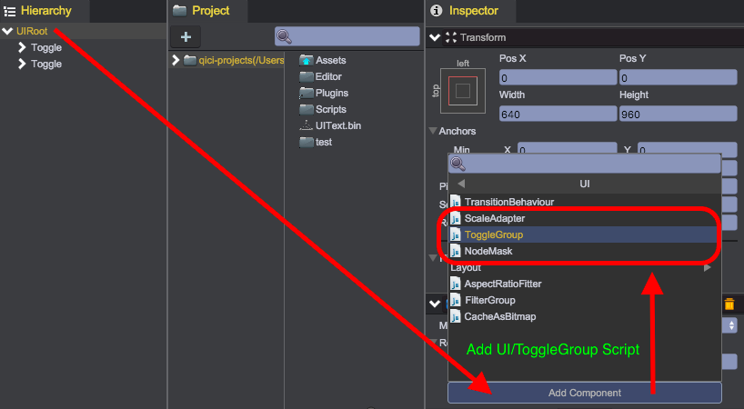
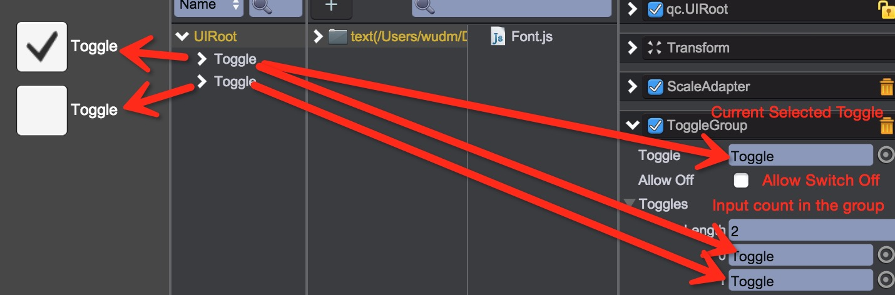

# 开关和开关组

## Toggle
qc.Toggle组件用于开关或单选按钮，允许用户点击进行开关状态切换。

Toggle开关由背景图、开启标记图、文本组成:  
  
作为一个可交互组件，同[Button](Button.html)一样可以有3种状态（State）：普通、按下、不可用

````javascript
var node = game.add.toggle(parent);
node.background.texture = game.assets.find('__builtin_resource__');
node.background.frame = 'button.png';
node.background.imageType = qc.UIImage.IMAGE_TYPE_SLICED;
node.checkMark.texture = G.game.assets.find('__builtin_resource__');
node.checkMark.frame = 'ok.png';
node.checkMark.imageType = qc.UIImage.IMAGE_TYPE_SLICED;
node.checkMark.width = 50;
node.checkMark.height = 50;
node.text.text = 'Toggle';
node.text.color = new qc.Color(0xffffff);
node.text.fontSize = 24;
// 设置开关为选中状态
node.on = true;
````

## ToggleGroup
可将qc.ToggleGroup逻辑脚本挂载在任意对象上，可以维护多个Toggle，提供单选按钮的功能，通过一个例子来体验其用法：
1. 从主菜单（游戏对象/开关）或工具条上的开关按钮，新建2个Toggle组件  

2. 在UIRoot节点挂载ToggleGroup脚本  

3. 在Inspector上设置ToggleGroup属性  
  
  * Toggle - 当前选中的开关节点
  * Allow Off - 是否允许没有Toggle被选中的情况
  * Toggles - 当前所有的开关列表

## API
* [Toggle API](http://docs.zuoyouxi.com/api/gameobject/CToggle.html)
* [ToggleGroup API](http://docs.zuoyouxi.com/api/components/ToggleGroup.html)

## Demo
* [Toggle Demo](http://engine.zuoyouxi.com/demo/Toggle/toggle_mixed/index.html)
