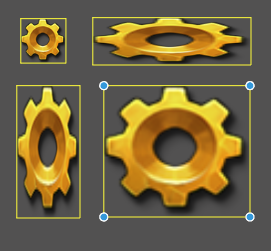
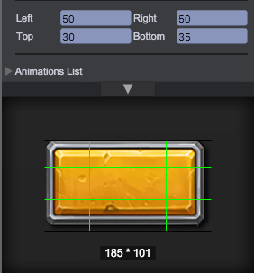
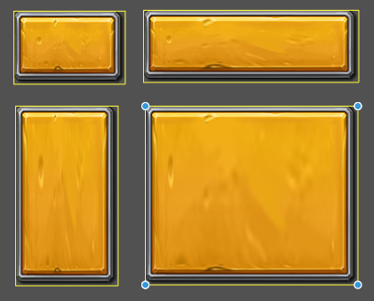

# 图片
qc.UIImage组件用来显示图片

## 创建图片
通过主菜单（游戏对象/图片）或工具条创建
````javascript
node = game.add.image(parent);
````
通过拖拽设置图片资源，如果是图集资源还需指定图片帧
````javascript
node.texture = game.assets.find('textureKey');
node.frame = 'background.png';
````


## 图片类型
目前支持简单、九宫格和平铺三种类型的显示方式

### 简单类型
默认类型，图片不进行平铺，只是拉伸填充满游戏对象矩形区域
````javascript
node.imageType = qc.UIImage.IMAGE_TYPE_SIMPLE
````


### 九宫格类型
九宫格图片被分割成九部分，四周图块保持固定尺寸，中间图块拉伸填充满游戏对象矩形区域剩下的中心部分。参见[九宫格](../NinePatch/index.html)
````javascript
node.imageType = qc.UIImage.IMAGE_TYPE_SLICED
````



### 平铺类型
图形进行平铺填充满游戏对象矩形区域，如果图片定义的[九宫格](../NinePatch/index.html)，则在仅在中间部分进行平铺
````javascript
node.imageType = qc.UIImage.IMAGE_TYPE_TILED
````


## ColorTint
图片混合色，alpha值不参与计算，默认值new qc.Color(0x00FFFFFF)不改变原始效果。参见[着色器](../Filter/index.html)
````javascript
node.colorTint = new qc.Color(0x00888888);
````
  

视频演示：  
<video controls="controls" src="../video/oper_uiimage.mp4"></video>  
 
## UIImage 常用的API列表
[UIImage API](http://docs.zuoyouxi.com/api/gameobject/CUIImage.html)

## UIImage 相关 Demo
[UIImage Demo](http://engine.zuoyouxi.com/demo/index.html#anchor_UIImage)

