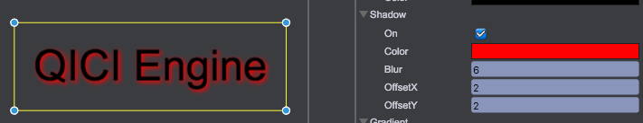

# 文本（UIText）

## 字体类型
qc.UIText目前引擎支持3种字体：
* 系统字体 - 在Font Family中选择"System"，在Font中输入字体名，如：Arial
* 网页字体 - 在Font Family中选择"Web"，参见[网页字体](../WebFont/README.md)
* 图片字体 - 在Font Family中选择"Bitmap"，参见[图片字体](../BitmapFont/README.md)

## 使用UIText
通过菜单(游戏对象/文本)或工具条文本按钮，创建一个UIText文本对象，在编辑中设置好位置和属性，实现如下效果：  


Inspector中设置属性如下：  


### Overflow
文字是否允许超出对象矩形边界

````javascript
node.overflow = false;
````


### Color
文字颜色

````javascript
node.color = new qc.Color(0xffff0000);
````

### ColorTint
文字混合色，alpha值不参与计算，默认值new qc.Color(0x00FFFFFF)不改变原始效果

````javascript
node.colorTint = new qc.Color(0x00888888);
````
### Text
文字内容
* 可通过'\n'实现换行
* 通过以下3种格式可指定局部颜色，并支持嵌套
  * [#RRGGBB]xxx[-]
  * [rgba(255,0,0,0.3)]xxx[-]
  * [rgb(255,0,0)]xxx[-]

````javascript
node.text = 'QICI Engine';

// 通过'\n'换行
node.text = 'QICI\nEngine';

// 嵌套指定局部颜色
node.text = 'QICI\nE[#00FFFF]ng[#FF00FF]i[-]n[-]e';
````


### Font Family
字体类型，目前支持以下三种类型
* UIText.SYSTEMFONT - 系统字体
* UIText.WEBFONT - 网页字体
* UIText.BITMAPFONT - 图片字体

````javascript
node.fontFamily = qc.UIText.SYSTEMFONT;
````

### Font
字体，根据不同的字体类型设置相应的值
````javascript
// 切换成系统字体类型
node.fontFamily = qc.UIText.SYSTEMFONT;
// 设置字体字符串名
node.font = 'Tahoma'

// 切换成网页字体类型
node.fontFamily = qc.UIText.WEBFONT;
// 设置qc.Font网页字体资源
node.font = game.assets.find('webFontKey');

// 切换成图片字体类型
node.fontFamily = qc.UIText.BITMAPFONT;
// 设置qc.Font图片字体资源
node.font = game.assets.find('bitmapFontKey');
````

### Bold
是否粗体
````javascript
node.bold = true;
````

### Font Size
字体大小
````javascript
node.fontSize = 27;
````

### Line Spacing
行间距
````javascript
node.lineSpacing = 2;
````

### AlignH
水平对齐方式
* UIText.LEFT - 左对齐
* UIText.RIGHT - 右对齐
* UIText.CENTER - 居中显示

````javascript
node.alignH = UIText.CENTER;
````

### AlignV
垂直对齐方式
* UIText.TOP - 上对齐
* UIText.BOTTOM - 下对齐
* UIText.MIDDLE - 居中显示

````javascript
node.alignV = UIText.MIDDLE;
````

### Wrap
文字是否根据对象矩形宽度自动折行

````javascript
node.wrap = true;
````

### Stroke
边缘样式，只对系统字体和网页字体有效
Thickness - 边缘粗细，strokeThickness
Color - 边缘颜色，stroke

````javascript
node.strokeThickness = 2;
node.stroke = new qc.Color(0xFFFF8888);
````

### Shadow
阴影相关参数
* On - 是否启用阴影，enableShadow
* Color - 阴影颜色，shadowColor
* Blur - 阴影模糊距离，shadowBlur
* OffsetX - 阴影水平偏移，shadowOffsetX
* OffsetY - 阴影垂直偏移，shadowOffsetY

````javascript
node.enableShadow = true;
node.shadowColor = new qc.Color(0xFFFF0000);
node.shadowBlur = 6;
node.shadowOffsetX = 2;
node.shadowOffsetY = 2;
````


### Gradient
从上到下方向的渐进色，只对系统字体和网页字体类型有效
* On - 是否启用渐进色，gradient
* Start - 起始颜色，startColor
* End - 结束颜色，endColor

````javascript
node.gradient = true;
node.startColor = new qc.Color(0xFFFF0000);
node.endColor = new qc.Color(0xFF00FF00);
````


### Glow
光晕效果
* On - 是否启用光晕，enableGlow
* Color - 光晕颜色，glowColor
* Blur - 光晕模糊距离，glowBlur

````javascript
node.enableGlow = true;
node.glowBlur = 3;
node.glowColor = new qc.Color(0xFF0000FF);
````

## UIText 常用的属性列表
[UIText 属性](http://docs.zuoyouxi.com/api/gameobject/CUIText.html)

## UIText 相关 Demo
[UIText Demo](http://engine.zuoyouxi.com/demo/index.html#anchor_UIText)
