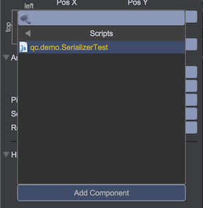
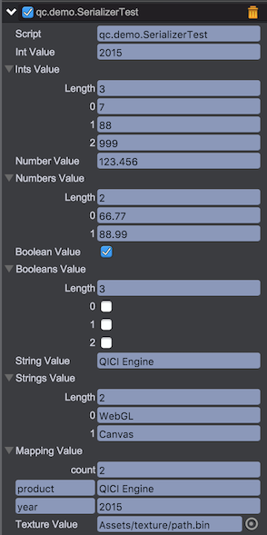

# 序列化

编辑器中保存游戏场景，保存预制对象，以及拷贝粘帖节点功能都是基于序列化功能的应用。即青瓷引擎可对任何游戏节点进行序列化和反序列化，场景的保存即对game.world对象进行序列化。序列化一个节点时将保存该节点，以及所有子孙节点信息，包括节点上挂载的脚本对象。

## 代码示例
以下通过代码演示对一个游戏对象进行序列化和反序列化的过程，这些工作由编辑器完成，用户不要直接调用代码。

### 节点序列化
````javascript
// 构建一个UIImage对象
var image = game.add.image();

// 设置一些属性
image.x = 234;
image.y = 567;
image.rotation = 1.667788

// 通过buildBundle将image对象转换json格式数据
var context = {};
json = this.game.serializer.buildBundle(image, context);
json.dependences = this.game.serializer.combineDependence(context);
var content = JSON.stringify(json);
````
以上操作后得到如下的content内容
````javascript
"{"class":"qc.UIImage","data":{"uuid":"6d4b3ef1-327c-40d4-b0bc-f3757257aa30","_prefab":[7,""],"name":[7,"UIImage"],"ignoreDestroy":[5,null],"alpha":[3,1],"visible":[5,true],"colorTint":[14,16777215],"static":[5,false],"scripts":[],"position":[0,0,234,567,234,567,100,100,0,0,0,0,0,0,0,0],"scaleX":[3,1],"scaleY":[3,1],"rotation":[3,1.667788],"interactive":[5,false],"isFiltersThrough":[5,null],"children":[],"texture":null,"frame":null,"imageType":[3,0]},"dependences":{}}"
````

### 节点反序列化
通过以下代码可将json数据反序列化出UIImage对象和所有属性数据（引擎底层实现，用户不要直接调用）
````javascript
var image = game.serializer.restoreBundle(json);
image.x === 234 // true
image.y === 567 // true
image.rotation === 1.667788 // true
````

## 可序列化的数据类型
目前支持如下数据类型的序列化和反序列化，一般在定义脚本类时对需要序列化的属性进行配置：
* qc.Serializer.AUTO - 自动类型，设置为该类型时，内部将自动判断
* qc.Serializer.INT - 整数
* qc.Serializer.INTS - 整数数组
* qc.Serializer.NUMBER - 数字
* qc.Serializer.NUMBERS - 数字数组
* qc.Serializer.BOOLEAN - 布尔类型
* qc.Serializer.BOOLEANS - 布尔类型数组
* qc.Serializer.STRING - 字符串
* qc.Serializer.STRINGS - 字符串数组
* qc.Serializer.MAPPING - 数值对
* qc.Serializer.TEXTURE - 图集
* qc.Serializer.TEXTURES - 图集数组
* qc.Serializer.AUDIO - 声音
* qc.Serializer.AUDIOS - 声音数组
* qc.Serializer.COLOR - 颜色
* qc.Serializer.COLORS - 颜色数组
* qc.Serializer.PREFAB - 预制
* qc.Serializer.PREFABS - 预制数组
* qc.Serializer.NODE - 节点
* qc.Serializer.NODES - 节点数组
* qc.Serializer.POINT - 点
* qc.Serializer.RECTANGLE - 矩形
* qc.Serializer.CIRCLE - 圆
* qc.Serializer.ELLIPSE - 椭圆
* qc.Serializer.TEXTASSET - 文本资源
* qc.Serializer.EXCELASSET - Excel文件资源

## 演示代码
1. 在Assets/Scripts目录下增加脚本文件：SerializerTest.js
2. 代码内容如下：
````javascript	
var SerializerTest = qc.defineBehaviour('qc.demo.SerializerTest', qc.Behaviour, function() {
	// 初始化字段值
	this.intValue = 679;
	this.intsValue = [77, 88, 99];
	this.numberValue = 123.456;
	this.numbersValue = [1.1, 2.2, 3.3];
	this.booleanValue = true,
	this.booleansValue = [false, true, false];
	this.stringValue = 'QICI Engine';
	this.stringsValue = ['A', 'BB', 'CCC'];
	this.mappingValue = { firstName: 'eric', lastName: 'lin' };
	this.textureValue = null;
	this.texturesValue = [];
	this.audioValue = null;
	this.audiosValue = [];
	this.colorValue = null;
	this.colorsValue = [];
	this.prefabValue = null;
	this.prefabsValue = [];
	this.nodeValue = null;
	this.nodesValue = [];
	this.pointValue = new qc.Point(55, 66);
	this.rectangleValue = new qc.Rectangle(1, 2, 3, 4);
	this.circleValue = new qc.Circle(100, 200, 33);
	this.ellipseValue = new qc.Ellipse(11, 22, 33, 44);
	this.textAssetValue = null;
	this.excelAssetValue = null;
}, {
	// 定义需要序列化的字段类型
	intValue: qc.Serializer.INT,
	intsValue: qc.Serializer.INTS,
	numberValue: qc.Serializer.NUMBER,
	numbersValue: qc.Serializer.NUMBERS,
	booleanValue: qc.Serializer.BOOLEAN,
	booleansValue: qc.Serializer.BOOLEANS,
	stringValue: qc.Serializer.STRING,
	stringsValue: qc.Serializer.STRINGS,
	mappingValue: qc.Serializer.MAPPING,
	textureValue: qc.Serializer.TEXTURE,
	texturesValue: qc.Serializer.TEXTURES,
	audioValue: qc.Serializer.AUDIO,
	audiosValue: qc.Serializer.AUDIOS,
	colorValue: qc.Serializer.COLOR,
	colorsValue: qc.Serializer.COLORS,
	prefabValue: qc.Serializer.PREFAB,
	prefabsValue: qc.Serializer.PREFABS,
	nodeValue: qc.Serializer.NODE,
	nodesValue: qc.Serializer.NODES,
	pointValue: qc.Serializer.POINT,
	rectangleValue: qc.Serializer.RECTANGLE,
	circleValue: qc.Serializer.CIRCLE,
	ellipseValue: qc.Serializer.ELLIPSE,
	textAssetValue: qc.Serializer.TEXTASSET,
	excelAssetValue: qc.Serializer.EXCELASSET
});
````

3. 在场景中新建个空节点，并将此脚本挂载上去，编辑Inspector面板将自动显示需要序列化的脚本属性，编辑之得到如下结果：  
  
  
  

## 自定义的属性
通过自己实现属性的写入、还原来达成，代码如下：
````javascript
var SerializerTest = qc.defineBehaviour('qc.demo.SerializerTest', qc.Behaviour, function() {
		// 内部属性值
	    this.xValue = 100;
	    this.yValue = 200;
	    this.zValue = 300;
	}, {
		// 定义需序列化属性名vector3d
	    vector3d: {
	    	// 定义属性读函数
	        get: function(object) {
	            return [object.xValue, object.yValue, object.zValuke];
	        },
	        // 定义属性写函数
	        set: function(object, value) {
	            if (value) {
	                object.xValue = value[0];
	                object.yValue = value[1];
	                object.zValue = value[2];
	            }
	        }
	    }
	});
````
上述代码序列化后，保存的信息是vector3d:[x,y,z]，反序列化到内存中则表现为是对象的xValue、yValue、zValue。

参见[Inspector扩展](../ExtendEditor/Inspector.md)

## Demo
[Serializer Demo](http://engine.zuoyouxi.com/demo/misc/serializer/index.html)
