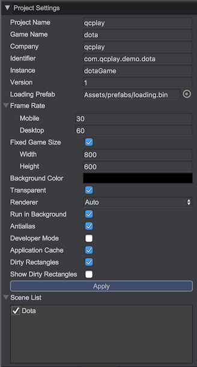
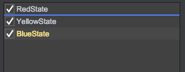

# 工程设置

## 打开工程设置
选择主菜单: __工程/设置...__	
  

## 属性说明
* __Project Name__ - 工程名称
* __Game Name__ - 游戏名称（将默认作为页面标题）
* __Company__ - 公司名称或开发者名称
* __Identifier__ - 唯一标识符，如：com.qici.demo，game.storage用于区分存储域
* __Instance__ - 游戏运行页面中game实例变量名，例如为qc_game，那么通过window.qc_game就可以访问	
* __Version__ - 游戏的版本号，例如2.0.1，参见[发布](../Publish/index.html)
* __Loading Prefab__ - 资源加载和场景切换的预制，参见[场景加载界面](../LoadingPrefab/index.html)
* __Frame Rate/Mobile__ - 游戏运行在移动上的帧率限制
* __Frame Rate/Desktop__ - 游戏运行在PC电脑上的帧率限制
* __Fixed Game Size/Width__ - 固定游戏大小的宽度
* __Fixed Game Size/Height__ - 固定游戏大小的高度
* __Background Color__ - 游戏的背景色
* __Transparent__ - 勾选时，游戏世界的背景是透明的(Background Color不起效)
* __Renderer__ - 渲染模式，可选择WebGL，Canvas，或Auto由引擎自动选择
* __Run In Background__ - 当游戏失去焦点时是否继续运行
* __Antialias__ - 是否开启抗锯齿功能（打开时，性能会有一定的损失）
* __Developer Mode__ - 是否处于开发模式（如果勾选，发布时调试模式将被打开，适用于问题排查时使用）
* __Application Cache__ - 是否开启 [Application Cache](https://developer.mozilla.org/zh-CN/docs/Web/HTML/Using_the_application_cache) 功能（如果勾选，发布时会生成 [Application Cache](https://developer.mozilla.org/zh-CN/docs/Web/HTML/Using_the_application_cache) 相关 manifest 文件）
* __Dirty Rectangles__ -
  是否开启脏矩形绘制，参见[脏矩形](../DirtyRectangles/README.md)
* __Show Dirty Rectangles__ - 是否显示重绘的脏矩形区域信息

__以上属性修改完毕后，记得点击“应用”按钮起效。__

视频演示：  
<video controls="controls" src="../video/change_settings.mp4"></video>  

## 场景列表
* 所有Assets/scene目录下的游戏场景都将在此窗口中显示
* 勾选所有需要发布的游戏场
* 第一个勾选的为入口场景，运行时系统会自动加载，在入口场景一般会做游戏初始化、资源初始化等工作，通过拖拽可改变场景列表顺序：	
 

