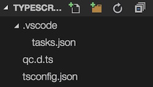

# TypeScript支持

## 初始化
选择菜单：工程/TypeScript/初始化，系统自动在工程目录下创建“TypeScripts”目录，所有的代码文件都放在此文件夹中。其初始目录结构如下：  
  
* qc.d.ts: 引擎的接口声明文件
* tsconfig.json和.vscode目录：Visual Studio Code必要的工程配置信息

QICI引擎未提供TypeScript的代码编辑工具，推荐您使用：[Visual Studio Code](https://www.visualstudio.com/products/code-vs)。

## 创建ts代码文件
使用Visual Studio Code打开TypeScripts目录，新建文件：Test.ts：  
````javascript
namespace qc.demo {
    export class Test extends Behaviour {
        year: number;
        private serializableFields: Object = {
            year: qc.Serializer.NUMBER
        }
        
        constructor(gameObject: Node) {
            super(gameObject);
            
            // Init the behaviour
            this.year = 2016;
        }
    }
    qc.registerBehaviour('qc.demo.Test', Test);
}

````

这是一个标准的定义Behaviour类的模板（功能等同于qc.defineBehaviour接口），我们定义了一个Test类，放置于qc.demo名字空间。在类中定义了一个number类型的可序列化字段year。最后调用qc.registerBehaviour将此类注册给引擎。

## 编译
编译可以有两种方式：  
1. 在Visual Studio Code中直接编译
2. 编辑器中选择菜单：工程/TypeScript/编译

编译成功后，目标文件在Scripts目录下（ts.js）。后续的编辑器操作和普通流程就一样了。

## Demo
* [TypeScript Demo](http://engine.zuoyouxi.com/demo/index.html#anchor_TypeScript)
