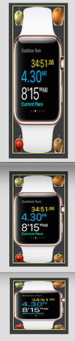

# 屏幕自适应
本节重点介绍UIRoot控件和挂载的ScaleAdapter组件，通过ScaleAdapter组件可以将界面元素缩放到最合适的尺寸。
可参考 [Demo](http://engine.zuoyouxi.com/demo/Layout/uiroot_adapt/index.html)

## UIRoot
一般来说所有的UI元素，应该挂载在UIRoot节点下面，在编辑器中创建UI组件时，编辑器会自动创建UIRoot节点。UIRoot自动挂载了qc.ScaleAdapter脚本组件，用来缩放UI以自适应各种分辨率。

## ScaleAdapter
挂载ScaleAdapter脚本组件示例代码如下（大部分情况下，你不需要这样写代码来挂载）：
````javascript
scaleAdapter = node.addScript('qc.ScaleAdapter');
scaleAdapter.referenceResolution = new qc.Point(640, 960);
scaleAdapter.manualType = qc.ScaleAdapter.EXPAND;
scaleAdapter.fullTarget = true;
````

在编辑器中选择UIRoot节点，可在Inspector面板中编辑ScaleAdapter属性   


### Reference Resolution
````javascript
scaleAdapter.referenceResolution = new qc.Point(640, 960);
````
分辨率属性referenceResolution用于指定期望的游戏大小，或为美术设计界面时采取的分辨率，UI的缩放将以此分辨率为参考并尽量适配之。例如用iPhone4或iPhone4s为设计原型，那么分辨率为640x960（竖版）或960x640（横版）

### Manual Type
目前支持如下几种缩放自适应类型，以如下例子做示范：    
      
以上例子我们构建了四个水果图片分别定位在四个角落，居中摆放了个手表图片，将UIRoot的referenceResolution大小设置成和手表图片的大小一致。

1. **None**
````javascript
scaleAdapter.manualType = qc.ScaleAdapter.NONE;
````
不进行任何缩放，此时脚本组件不起效  


2. **Height**
````javascript
scaleAdapter.manualType = qc.ScaleAdapter.MANUAL_HEIGHT;
````
保持高度进行等比缩放，例如ReferenceResolution = (640, 960)，当前分辨率为：(400, 480)， 那么：
UIRoot的height为：960（与ReferenceResolution.y一致）
UIRoot的缩放为：480 / 960 = 0.5，即：scaleX = 0.5，scaleY = 0.5
UIRoot的width为：400 x 960 / 480 = 800，保持长宽比例   


3. **Width**
````javascript
scaleAdapter.manualType = qc.ScaleAdapter.MANUAL_WIDTH;
````
保持宽度进行等比缩放，例如ReferenceResolution = (640, 960)，当前分辨率为：(400, 480)， 那么：
UIRoot的width为：640（与ReferenceResolution.x一致）
UIRoot的缩放为：400 / 640 = 0.625，即：scaleX = 0.625，scaleY = 0.625
UIRoot的height为：480 x 640 / 400 = 768，保持长宽比例  


4. **Expand**
````javascript
scaleAdapter.manualType = qc.ScaleAdapter.EXPAND;
````
等比缩放，保证内容能完全放入目标屏幕分辨率内。系统自动根据当前分辨率来判定采用Width还是Height模式，以确保内容能完整显示。可以理解为如果参考分辨率是640*960，那么UIRoot的宽始终大于等于640，高始终大于等于960。这种方式在实际开发中最常用。   


5. **Shrink**
````javascript
scaleAdapter.manualType = qc.ScaleAdapter.SHRINK;
````
等比缩放，使内容能够填满目标分辨率。与Expand不同的是，Expand保证内容全部显示，Shrink保证屏幕被填满（部分内容会被截断）。可以理解为如果参考分辨率是640*960，那么UIRoot的宽始终小于等于640，高始终小于等于960。       
    

6. **Fill**
````javascript
scaleAdapter.manualType = qc.ScaleAdapter.FILL;
````
非等比缩放，保证目标的Width和Height和参考分辨率一样，使得内容刚好填满窗口。这会导致UI元素变形，因此也很少用。  


