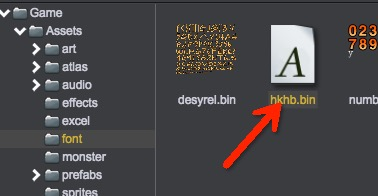

# 网页字体
通常我们使用的是本地系统已安装的字体，而采用网页字体(Web Fonts)功能我们可使用从远端服务器动态下载的字体。

## 创建WebFont资源
1. 选择主菜单：Tool/Create WebFont
2. 在Inspector面板中，输入字体信息：  
  
	* __Name__: 填写字体的名字	
	* __Font URLs__: 填写WebFont资源在工程中得路径，或绝对路径如：http://www.zuoyouxi.com/test.ttf  
3. 点击“Save”按钮保存，字体信息将被保存在Assets/font目录  
  

## 使用WebFont
1. 新建场景，创建Text组件
2. 设置"Font Family"选择字体的类型为：Web
3. 将字体信息设置到Font字段  

## Demo
[WebFont Demo](http://engine.zuoyouxi.com/demo/UIText/font_webFont/index.html)
