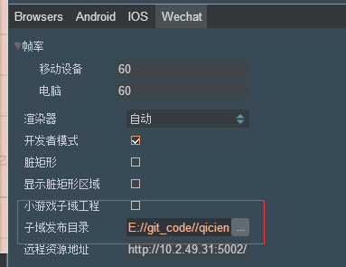

# 微信小游戏开放域
微信小游戏为了保护其社交关系链数据，增加了子域的概念，子域又叫开放数据域，是一个单独的游戏执行环境。子域中的资源、引擎、程序，都和主游戏完全隔离，开发者
需要在子域中通过指定接口取得好友用户数据，然后在 sharedCanvas 中渲染数据，再在主域中将 sharedCanvas 绘制到上屏 canvas 上。   
具体的可参考[微信开放数据域](https://developers.weixin.qq.com/minigame/dev/tutorial/open-ability/open-data.html)。  

## 创建工程配置 
开发者需要创建两个独立的项目：
* 子域项目工程（用于获得用户数据来做排行榜等功能的项目）  
  
在发布界面中要勾选 _小游戏子域工程_，然后点 Build 发布子域代码，默认会在 build/wechat/DevProject/Code 目录下生成小游戏子域目录代码

* 主域项目工程（正常的游戏项目）  
  
在发布界面中不要勾选 _小游戏子域工程_，然后设置对应的子域发布目录，上面所说的 build/wechat/DevProject/Code 目录。然后点 Build 发布，即能自动生成对子域的支持
（在发布目录 Code 下会生成子域对应的文件夹，game.json 中自动配置子域内容）
  
## 主域和子域的整合注意事项 
* 子域中的 ui 布局要与主域中的 ui 布局保持一致（在主域中要有一个 UIImage 节点区域，用于绘制子域需要显示到主域的内容），需要计算主域 UIImage 节点区域
与子域需要显示内容区域的对应关系，以便能正确的将子域指定区域的 ui 绘制到主域 canvas 对应区域上  
* 在主域中通过 [qc.AssetUtil.createAtlasFromCanvas](http://docs.zuoyouxi.com/api/assets/createAtlasFromCanvas.html) 接口将 sharedCanvas 转成 qc.Atlas 对象，将其赋给 UIImage 节点，即可显示 sharedCanvas 内容  
* 如果子域有操作性功能，比如滑动、拖拽、点击等操作，那么在主域中就需要在 update 中实时调用 [qc.AssetUtil.createAtlasFromCanvas](http://docs.zuoyouxi.com/api/assets/createAtlasFromCanvas.html) 接口获取最新的 sharedCanvas
内容来刷新 UIImage  

## Demo
[Game Demo](http://engine.zuoyouxi.com/demo/index.html#anchor_Wechat)  
