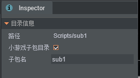

# 微信小游戏分包
微信小游戏增加了分包加载功能，小游戏代码包总上限可以从之前的 4 M提升至 8 M。开发者可以根据游戏品类和场景需要，在合适时机加载指定包，提升打开速度，优化用户体验。
Qici Engine 提供了对分包的支持，只需要简单的几个步骤即可完成小游戏分包。 

## 创建分包目录 
* 新建一个文件夹，将分包的内容放在这个目录下 
* 在编辑器的文件管理器中选择该文件夹，Inspector 属性界面会显示该文件夹的配置选项： 
 
* 勾选 _小游戏子包目录_，表示该文件夹下的内容为子包内容 
* 设置子包名，默认会使该文件夹的名字 

## 项目构建 
* 在发布目录 Code 下会以子包名生成文件夹，文件夹下会生成 game.js 文件，该文件包含子包所有代码，并且这些代码会从主包中剔除掉 
* 在小游戏的 game.json 配置文件中会自动生成子包的配置内容 

## Demo 
[Game Demo](http://engine.zuoyouxi.com/demo/index.html#anchor_Wechat)  